# NEXT Freight — Platform Technical Specification

> Full-scope build (no MVP staging). Truck freight marketplace for the Middle East.
> **Mobile:** Kotlin Multiplatform + Compose Multiplatform (2 apps: Client, Driver)
> **Backend:** Java Spring Boot + MySQL
> **Control Panel:** REST API + React SPA
> **Infra:** VPS + Cloudflare CDN

---

## Table of Contents

1. [Product Overview](#1-product-overview)
2. [Actors, Roles & Memberships](#2-actors-roles--memberships)
3. [Permissions Matrix](#3-permissions-matrix)
4. [System Architecture](#4-system-architecture)
5. [Technology Stack](#5-technology-stack)
6. [Multi-Country, Multi-Currency, Multi-Language](#6-multi-country-multi-currency-multi-language)
7. [Authentication & Authorization](#7-authentication--authorization)
8. [Registration & Approval Flows](#8-registration--approval-flows)
9. [Order Lifecycle](#9-order-lifecycle)
10. [Dispatch Engine](#10-dispatch-engine)
11. [Pricing Engine](#11-pricing-engine)
12. [Cross-Border Shipments](#12-cross-border-shipments)
13. [Payments, Wallet, COD & Payouts](#13-payments-wallet-cod--payouts)
14. [Subscriptions & Carrier Tiers](#14-subscriptions--carrier-tiers)
15. [Violation & Compliance Engine](#15-violation--compliance-engine)
16. [Chat, Notifications & Real-Time](#16-chat-notifications--real-time)
17. [Ratings & Public Tracking](#17-ratings--public-tracking)
18. [Database Design](#18-database-design)
19. [REST API Reference](#19-rest-api-reference)
20. [Control Panel Specification](#20-control-panel-specification)
21. [Mobile Apps Specification](#21-mobile-apps-specification)
22. [Infrastructure & Deployment](#22-infrastructure--deployment)
23. [Security & Compliance](#23-security--compliance)
24. [Delivery Plan](#24-delivery-plan)
25. [Assumptions & Open Items](#25-assumptions--open-items)

---

## 1. Product Overview

NEXT Freight connects **clients** who need to move cargo with **carriers** who own trucks. It supports domestic and cross-border shipments across Middle East countries.

### Core value flow


```mermaid
flowchart LR
    A["Client requests truck"] --> B["Pricing engine quotes price"]
    B --> C["Client pays or selects COD"]
    C --> D["Dispatch broadcasts to nearby drivers"]
    D --> E["Driver accepts"]
    E --> F["Pickup with OTP + photo proof"]
    F --> G["Live tracking"]
    G --> H["Delivery with photo + signature proof"]
    H --> I["Platform settles: commission + carrier payout"]
    I --> J["Both sides rate each other"]
```

### Feature scope

| Domain | Included |
|---|---|
| Ordering | single & multi-stop, scheduled orders, cross-border legs, cargo & vehicle matching, capacity validation |
| Dispatch | auto-broadcast with timer, first-accept wins, fallback to manual, fleet self-assign, broker re-assign |
| Pricing | fully CP-configurable factors, versioned rate cards per country, corridor fees, FX snapshot |
| Payments | HyperPay-first gateway abstraction, wallet, COD (toggleable), refunds, cancellation fees |
| Payouts | on-demand + threshold based, per-country methods: IBAN, wallet, ZainCash, CliQ, etc. |
| Memberships | paid client subscription plans, earned carrier tiers driven by activity scoring |
| Compliance | auto violation detection, points with decay, escalation ladder, appeals |
| Communication | in-app chat (text + image + voice, retained for disputes), push, in-app notifications, SOS |
| Trust | two-way ratings, proof of pickup/delivery, document verification, public tracking link |
| Ops | full control panel, live map, dispatch board, finance, reports, audit trail |

---

## 2. Actors, Roles & Memberships

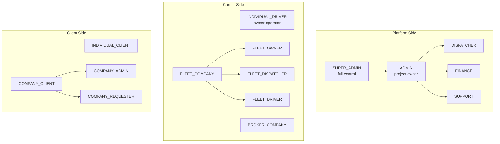
```mermaid
flowchart TD
    subgraph PLATFORM["Platform Side"]
        SA["SUPER_ADMIN<br/>full control"]
        AD["ADMIN<br/>project owner"]
        DP["DISPATCHER"]
        FN["FINANCE"]
        SP["SUPPORT"]
    end

    subgraph CARRIER["Carrier Side"]
        ID["INDIVIDUAL_DRIVER<br/>owner-operator"]
        FC["FLEET_COMPANY"]
        BR["BROKER_COMPANY"]
        FO["FLEET_OWNER"]
        FD["FLEET_DISPATCHER"]
        FDR["FLEET_DRIVER"]
    end

    subgraph CLIENT["Client Side"]
        IC["INDIVIDUAL_CLIENT"]
        CC["COMPANY_CLIENT"]
        CA["COMPANY_ADMIN"]
        CR["COMPANY_REQUESTER"]
    end

    SA --> AD --> DP
    AD --> FN
    AD --> SP
    FC --> FO
    FC --> FD
    FC --> FDR
    CC --> CA
    CC --> CR
```

### 2.1 Platform roles

| Role | Scope |
|---|---|
| `SUPER_ADMIN` | Everything, including role definitions, country onboarding, pricing engine, feature flags, other admins |
| `ADMIN` | Project owner. Everything operational: approvals, orders, users, pricing values, reports. Cannot change role definitions, delete audit logs, or manage other admins |
| `DISPATCHER` | Order assignment, re-assignment, live map, cancel/reschedule, contact parties |
| `FINANCE` | Payments, refunds, COD settlement, payouts, commissions, invoices, financial reports |
| `SUPPORT` | Read-only across ops + tickets, chat access for disputes, no money actions |

### 2.2 Carrier account types

| Type | Description | Owns Trucks | CP Access |
|---|---|---|---|
| `INDIVIDUAL_DRIVER` | Owner-operator. One person, one or more own vehicles | Yes | No (mobile only) |
| `FLEET_COMPANY` | Shipping company / fleet operator with multiple trucks and employed drivers | Yes | Yes — scoped portal |
| `BROKER_COMPANY` | Transport brokerage. Owns no trucks; receives orders and re-assigns to carriers under contract | No | Yes — scoped portal |

**Fleet / Broker sub-roles**

| Sub-role | Can |
|---|---|
| `FLEET_OWNER` | Full company scope: vehicles, drivers, wallet, payouts, sub-users, tier, reports |
| `FLEET_DISPATCHER` | Accept orders for the company, assign to company drivers, track, chat |
| `FLEET_DRIVER` | Mobile driver app only. Bound to the company, cannot self-register vehicles |

### 2.3 Client account types

| Type | Registration | CP Access |
|---|---|---|
| `INDIVIDUAL_CLIENT` | Phone + OTP self-serve, instant | No |
| `COMPANY_CLIENT` | Phone + OTP self-serve, instant, plus company profile and plan selection | Optional light web portal |

**Company client sub-roles:** `COMPANY_ADMIN` (billing, sub-users, plan, all orders) and `COMPANY_REQUESTER` (create and track own orders only).

### 2.4 Membership summary

| Side | Model | Driven by |
|---|---|---|
| Client | **Paid subscription plans** — Free / Plus / Business | Client purchase, benefits toggleable per plan from CP |
| Carrier | **Earned tiers** — Bronze / Silver / Gold / Platinum | Activity score computed from CP-configured rules, with manual admin override |

---

## 3. Permissions Matrix

Permissions are **granular string keys** (`order.assign`, `payout.approve`, ...) grouped into roles. Roles are editable by `SUPER_ADMIN`, so this matrix is the seeded default, not a hardcoded rule.

| Permission | SUPER_ADMIN | ADMIN | DISPATCHER | FINANCE | SUPPORT | FLEET_OWNER | FLEET_DISPATCHER | COMPANY_ADMIN |
|---|:--:|:--:|:--:|:--:|:--:|:--:|:--:|:--:|
| `country.manage` | ✅ | ❌ | ❌ | ❌ | ❌ | ❌ | ❌ | ❌ |
| `role.manage` | ✅ | ❌ | ❌ | ❌ | ❌ | ❌ | ❌ | ❌ |
| `admin.manage` | ✅ | ❌ | ❌ | ❌ | ❌ | ❌ | ❌ | ❌ |
| `featureflag.manage` | ✅ | ❌ | ❌ | ❌ | ❌ | ❌ | ❌ | ❌ |
| `pricing.factor.manage` | ✅ | ✅ | ❌ | ❌ | ❌ | ❌ | ❌ | ❌ |
| `corridor.manage` | ✅ | ✅ | ❌ | ❌ | ❌ | ❌ | ❌ | ❌ |
| `carrier.approve` | ✅ | ✅ | ❌ | ❌ | ❌ | ❌ | ❌ | ❌ |
| `carrier.suspend` | ✅ | ✅ | ❌ | ❌ | ❌ | ❌ | ❌ | ❌ |
| `vehicle.verify` | ✅ | ✅ | ❌ | ❌ | ❌ | ➖ own | ❌ | ❌ |
| `order.view.all` | ✅ | ✅ | ✅ | ✅ | ✅ | ➖ own | ➖ own | ➖ own |
| `order.create` | ✅ | ✅ | ✅ | ❌ | ❌ | ❌ | ❌ | ✅ |
| `order.assign` | ✅ | ✅ | ✅ | ❌ | ❌ | ➖ own drivers | ➖ own drivers | ❌ |
| `order.cancel` | ✅ | ✅ | ✅ | ❌ | ❌ | ➖ own | ➖ own | ➖ own |
| `order.reprice` | ✅ | ✅ | ❌ | ❌ | ❌ | ❌ | ❌ | ❌ |
| `tracking.view` | ✅ | ✅ | ✅ | ❌ | ✅ | ➖ own | ➖ own | ➖ own |
| `chat.read` | ✅ | ✅ | ✅ | ❌ | ✅ | ➖ own | ➖ own | ➖ own |
| `payment.view` | ✅ | ✅ | ❌ | ✅ | ✅ | ➖ own | ❌ | ➖ own |
| `payment.refund` | ✅ | ✅ | ❌ | ✅ | ❌ | ❌ | ❌ | ❌ |
| `cod.settle` | ✅ | ✅ | ❌ | ✅ | ❌ | ➖ own | ❌ | ❌ |
| `payout.request` | ❌ | ❌ | ❌ | ❌ | ❌ | ✅ | ❌ | ❌ |
| `payout.approve` | ✅ | ✅ | ❌ | ✅ | ❌ | ❌ | ❌ | ❌ |
| `subscription.plan.manage` | ✅ | ✅ | ❌ | ❌ | ❌ | ❌ | ❌ | ❌ |
| `tier.rule.manage` | ✅ | ✅ | ❌ | ❌ | ❌ | ❌ | ❌ | ❌ |
| `violation.rule.manage` | ✅ | ✅ | ❌ | ❌ | ❌ | ❌ | ❌ | ❌ |
| `violation.action.apply` | ✅ | ✅ | ❌ | ❌ | ❌ | ❌ | ❌ | ❌ |
| `violation.appeal.resolve` | ✅ | ✅ | ❌ | ❌ | ❌ | ❌ | ❌ | ❌ |
| `i18n.manage` | ✅ | ✅ | ❌ | ❌ | ❌ | ❌ | ❌ | ❌ |
| `report.view` | ✅ | ✅ | ➖ ops | ✅ | ✅ | ➖ own | ❌ | ➖ own |
| `audit.view` | ✅ | ✅ | ❌ | ❌ | ❌ | ❌ | ❌ | ❌ |

✅ full · ➖ scoped to own organization · ❌ denied

---

## 4. System Architecture

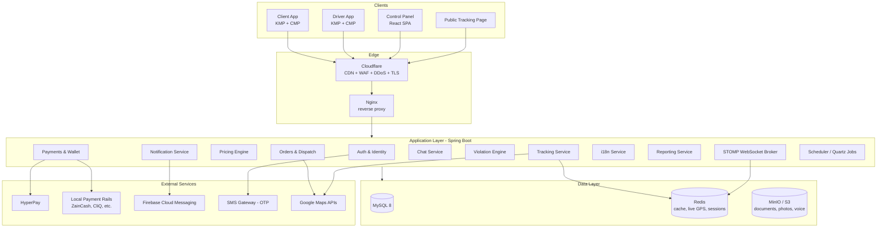
```mermaid
flowchart TB
    subgraph CLIENTS["Clients"]
        CA["Client App<br/>KMP + CMP"]
        DA["Driver App<br/>KMP + CMP"]
        CP["Control Panel<br/>React SPA"]
        PT["Public Tracking Page"]
    end

    subgraph EDGE["Edge"]
        CF["Cloudflare<br/>CDN + WAF + DDoS + TLS"]
        NG["Nginx<br/>reverse proxy"]
    end

    subgraph APP["Application Layer - Spring Boot"]
        AUTH["Auth & Identity"]
        ORD["Orders & Dispatch"]
        PRC["Pricing Engine"]
        PAY["Payments & Wallet"]
        TRK["Tracking Service"]
        CHT["Chat Service"]
        VIO["Violation Engine"]
        NOT["Notification Service"]
        I18N["i18n Service"]
        RPT["Reporting Service"]
        WS["STOMP WebSocket Broker"]
        JOB["Scheduler / Quartz Jobs"]
    end

    subgraph DATA["Data Layer"]
        MY[("MySQL 8")]
        RD[("Redis<br/>cache, live GPS, sessions")]
        S3[("MinIO / S3<br/>documents, photos, voice")]
    end

    subgraph EXT["External Services"]
        HP["HyperPay"]
        LP["Local Payment Rails<br/>ZainCash, CliQ, etc."]
        FCM["Firebase Cloud Messaging"]
        SMS["SMS Gateway - OTP"]
        GM["Google Maps APIs"]
    end

    CA --> CF
    DA --> CF
    CP --> CF
    PT --> CF
    CF --> NG
    NG --> APP
    APP --> DATA
    PAY --> HP
    PAY --> LP
    NOT --> FCM
    AUTH --> SMS
    ORD --> GM
    TRK --> GM
    TRK --> RD
    WS --> RD
```

### 4.1 Backend module layout

```
next-freight-api/
├── app-bootstrap/            Spring Boot main, profiles, config
├── common/
│   ├── common-core/          Result, errors, pagination, money, geo utils
│   ├── common-security/      JWT, filters, @PreAuthorize infra, tenant resolver
│   ├── common-web/           exception handler, response envelope, validation
│   └── common-i18n/          locale resolver, translation loader
├── modules/
│   ├── identity/             users, roles, permissions, OTP, sessions, devices
│   ├── organization/         fleets, brokers, company clients, members, docs
│   ├── catalog/              countries, currencies, languages, vehicle & cargo types, zones
│   ├── pricing/              rate cards, factors, corridors, quote calculator
│   ├── order/                orders, stops, legs, cargo, documents, state machine
│   ├── dispatch/             offer rounds, matching, assignment, escalation
│   ├── tracking/             GPS ingest, geofence, ETA, route deviation
│   ├── payment/              gateway adapters, wallet, ledger, COD, payouts
│   ├── subscription/         client plans, carrier tiers, scoring
│   ├── violation/            rules, detectors, points, actions, appeals
│   ├── chat/                 conversations, messages, media
│   ├── notification/         templates, dispatchers, FCM, in-app
│   ├── reporting/            aggregates, exports
│   └── admin/                CP-facing composite endpoints, audit log
└── integrations/
    ├── payments-hyperpay/
    ├── payments-zaincash/
    ├── payments-cliq/
    ├── maps-google/
    ├── sms-provider/
    └── storage-s3/
```

**Rule:** every external dependency sits behind an interface in its module (`PaymentProvider`, `MapProvider`, `SmsProvider`, `StorageProvider`). Adapters live in `integrations/`. Swapping HyperPay for another gateway, or Google Maps for MapLibre + OSRM, is a configuration change plus one new adapter — never a change in business code.

---

## 5. Technology Stack

### Backend

| Concern | Choice | Why |
|---|---|---|
| Language / Framework | Java 21, Spring Boot 3.x | Requested; LTS, virtual threads |
| Data | Spring Data JPA + Hibernate, MySQL 8 | Requested |
| Migrations | Flyway | Versioned, reviewable SQL |
| Query (complex) | JOOQ or native SQL for reports | JPA is poor for analytics |
| Security | Spring Security + JWT (access + refresh) | No external IdP cost, full control |
| Real-time | Spring WebSocket + STOMP, Redis relay | Free, native, KMP client available |
| Cache / live data | Redis | Live GPS, OTP throttling, sessions, rate limits |
| Jobs | Quartz (clustered) | Payout cycles, tier recalc, violation scans |
| Files | MinIO (S3 API) on VPS | Cheap, S3-compatible, easy migration to AWS later |
| Search / reports | MySQL + materialized summary tables | Avoids Elasticsearch cost at this scale |
| API docs | springdoc-openapi | Generates client contracts |
| Observability | Micrometer + Prometheus + Grafana + Loki | Self-hosted, no license cost |

### Control Panel

| Concern | Choice |
|---|---|
| Framework | React 18 + TypeScript + Vite |
| Routing | React Router |
| Data | TanStack Query + Axios |
| State | Zustand |
| UI | Tailwind + shadcn/ui |
| Tables | TanStack Table |
| Charts | Recharts |
| Maps | Google Maps JS API |
| Forms | React Hook Form + Zod |
| i18n | i18next, strings loaded from the same server endpoint as mobile |
| RTL | dynamic `dir` from language metadata |

### Mobile

| Concern | Choice |
|---|---|
| Shared | Kotlin Multiplatform |
| UI | Compose Multiplatform (Android + iOS) |
| Networking | Ktor Client + kotlinx.serialization |
| DI | Koin |
| Local DB | SQLDelight |
| Prefs / secure | multiplatform-settings + Keychain/Keystore |
| Async | Coroutines + Flow |
| Navigation | Compose Navigation (multiplatform) |
| Images | Coil 3 |
| Maps | Google Maps SDK via expect/actual behind `:core:maps` |
| Real-time | KStomp / Ktor WebSocket in `:core:realtime` |
| Push | FCM (covers Android + iOS APNs) |
| Build | Gradle version catalogs, convention plugins |

---

## 6. Multi-Country, Multi-Currency, Multi-Language

Three **independent** axes. A user in Iraq can read the app in English; a Turkish company can be billed in TRY while reading Arabic.

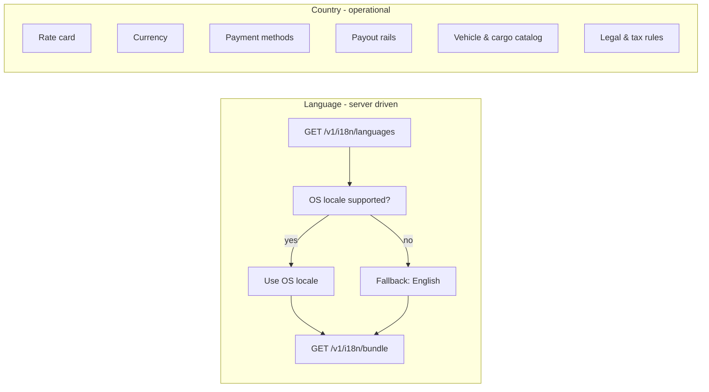
```mermaid
flowchart LR
    subgraph LANG["Language - server driven"]
        L1["GET /v1/i18n/languages"]
        L2["OS locale supported?"]
        L3["Use OS locale"]
        L4["Fallback: English"]
        L5["GET /v1/i18n/bundle"]
    end
    subgraph CTRY["Country - operational"]
        C1["Rate card"]
        C2["Currency"]
        C3["Payment methods"]
        C4["Payout rails"]
        C5["Vehicle & cargo catalog"]
        C6["Legal & tax rules"]
    end
    L1 --> L2
    L2 -->|yes| L3
    L2 -->|no| L4
    L3 --> L5
    L4 --> L5
```

### 6.1 Language

- Server owns the language list. Each language: `code`, `native_name`, `direction` (`rtl` / `ltr`), `is_active`, `bundle_version`.
- App startup: fetch language list → match OS locale → if unsupported, **English** → download bundle → cache with version → delta-update afterwards.
- **RTL is never hardcoded.** Layout direction is applied from the `direction` field, so a new RTL language (Urdu, Farsi, Kurdish Sorani) needs zero app release.
- Bundle is a flat key/value JSON, cached in SQLDelight. If the network fails, the last cached bundle is used; if none exists, the app ships a bundled English fallback.
- All server-generated user-facing text (notifications, order statuses, violation reasons, rejection reasons) uses **translation keys + parameters**, never raw sentences, so the app renders in the user's language.

### 6.2 Country & currency

- `country` holds: ISO code, phone code, default timezone, default language, `currency_code`, active flag, COD enabled flag, allowed payment methods, allowed payout methods.
- **Settlement currency = pickup country currency.** This is the currency the order is priced, charged, and settled in.
- **Display currency** is a user preference. Conversion uses `fx_rates` (rate + platform margin), and the rate is **snapshotted onto the order** at quote time — historical orders never change value.
- Money is stored as `BIGINT` minor units + `currency_code`. No floating point anywhere.
- Currencies with no minor unit (IQD as used in practice) are handled by a per-currency `decimal_digits` field for display and rounding.

### 6.3 Country-scoped configuration

Everything below is per-country and editable in CP: rate card & factors, corridor fees, vehicle types & capacities, cargo types, COD on/off, cancellation fee %, commission %, payment methods, payout methods & minimums, violation thresholds, subscription plan availability and pricing, tax/VAT rules.

---

## 7. Authentication & Authorization

### 7.1 Methods per actor

| Actor | Method | Approval needed |
|---|---|---|
| Individual client | Phone + OTP | No — instant |
| Company client | Phone + OTP + company profile + plan selection | No — instant |
| Individual driver | Registration form + documents, then Phone + OTP login | **Yes — admin activates** |
| Fleet company | Registration form + fleet + documents | **Yes — admin activates** |
| Broker company | Registration form + company docs | **Yes — admin activates** |
| Fleet driver | Created by fleet, activated by fleet, verified by admin | Yes |
| CP staff | Email + password + TOTP 2FA | Created by admin |

### 7.2 Client OTP login

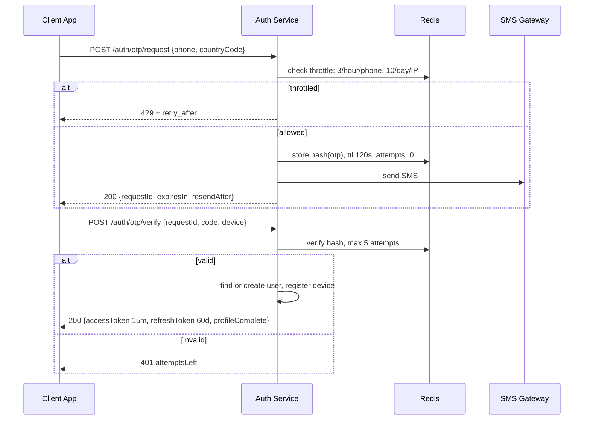
```mermaid
sequenceDiagram
    participant A as Client App
    participant S as Auth Service
    participant R as Redis
    participant G as SMS Gateway

    A->>S: POST /auth/otp/request {phone, countryCode}
    S->>R: check throttle: 3/hour/phone, 10/day/IP
    alt throttled
        S-->>A: 429 + retry_after
    else allowed
        S->>R: store hash(otp), ttl 120s, attempts=0
        S->>G: send SMS
        S-->>A: 200 {requestId, expiresIn, resendAfter}
    end
    A->>S: POST /auth/otp/verify {requestId, code, device}
    S->>R: verify hash, max 5 attempts
    alt valid
        S->>S: find or create user, register device
        S-->>A: 200 {accessToken 15m, refreshToken 60d, profileComplete}
    else invalid
        S-->>A: 401 attemptsLeft
    end
```

### 7.3 Carrier login with approval gate

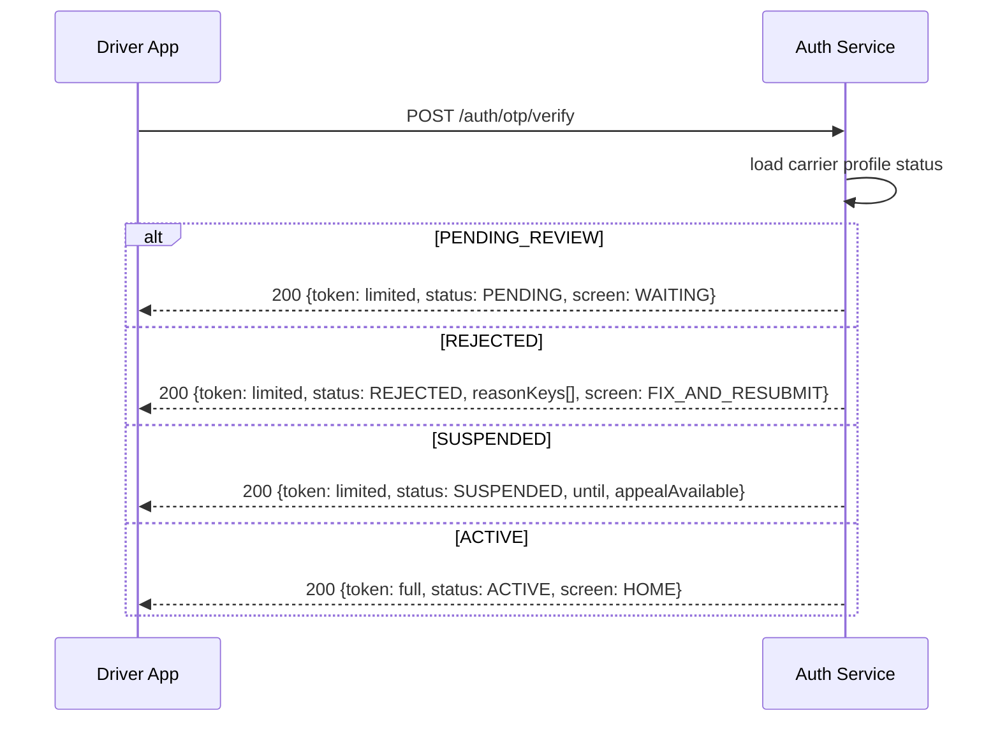
```mermaid
sequenceDiagram
    participant D as Driver App
    participant S as Auth Service

    D->>S: POST /auth/otp/verify
    S->>S: load carrier profile status
    alt PENDING_REVIEW
        S-->>D: 200 {token: limited, status: PENDING, screen: WAITING}
    else REJECTED
        S-->>D: 200 {token: limited, status: REJECTED, reasonKeys[], screen: FIX_AND_RESUBMIT}
    else SUSPENDED
        S-->>D: 200 {token: limited, status: SUSPENDED, until, appealAvailable}
    else ACTIVE
        S-->>D: 200 {token: full, status: ACTIVE, screen: HOME}
    end
```

A **limited token** grants only: read own application status, edit/resubmit application, upload documents, open support, submit appeal. It cannot go online, view offers, or touch money endpoints.

### 7.4 Token model

| Token | TTL | Storage |
|---|---|---|
| Access (JWT) | 15 min | memory + encrypted prefs |
| Refresh (opaque, rotating) | 60 days mobile / 12 h CP | DB `refresh_tokens`, hashed |

- Refresh rotation with reuse detection: a replayed refresh token revokes the whole family and forces re-login.
- JWT claims: `sub`, `userKind`, `roles[]`, `permissions[]` (compacted), `orgId`, `countryId`, `tier`, `jti`, `ver`. Bumping `ver` on the user invalidates all live tokens instantly.
- CP requires TOTP 2FA for `SUPER_ADMIN`, `ADMIN`, `FINANCE`.
- Device binding: refresh tokens are tied to `device_id`; users can list and revoke sessions.

### 7.5 Authorization layers

1. **Role/permission** — `@PreAuthorize("hasAuthority('order.assign')")`
2. **Tenant scope** — an org-scoped user's queries are automatically filtered by `orgId` via a Hibernate filter. A fleet dispatcher physically cannot read another fleet's rows.
3. **Ownership** — a client reads only own orders; a driver reads only assigned orders.
4. **State guard** — the order state machine rejects illegal transitions regardless of role.
5. **Audit** — every write by a CP user is logged with actor, IP, before/after diff.

---

## 8. Registration & Approval Flows

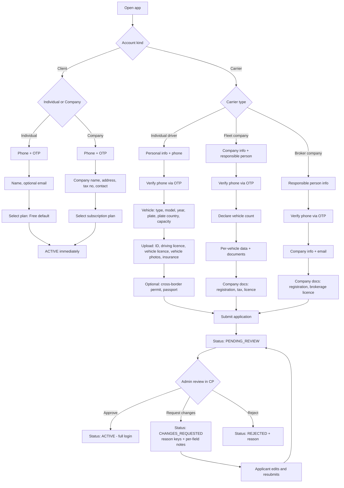
```mermaid
flowchart TD
    START["Open app"] --> KIND{"Account kind"}

    KIND -->|Client| CI{"Individual or Company"}
    CI -->|Individual| C1["Phone + OTP"] --> C2["Name, optional email"] --> C3["Select plan: Free default"] --> CACT["ACTIVE immediately"]
    CI -->|Company| K1["Phone + OTP"] --> K2["Company name, address, tax no, contact"] --> K3["Select subscription plan"] --> CACT

    KIND -->|Carrier| CT{"Carrier type"}
    CT -->|Individual driver| D1["Personal info + phone"]
    D1 --> D2["Verify phone via OTP"] --> D3["Vehicle: type, model, year, plate, plate country, capacity"] --> D4["Upload: ID, driving licence, vehicle licence, vehicle photos, insurance"] --> D5["Optional: cross-border permit, passport"] --> SUB["Submit application"]
    CT -->|Fleet company| F1["Company info + responsible person"] --> F2["Verify phone via OTP"] --> F3["Declare vehicle count"] --> F4["Per-vehicle data + documents"] --> F5["Company docs: registration, tax, licence"] --> SUB
    CT -->|Broker company| B1["Responsible person info"] --> B2["Verify phone via OTP"] --> B3["Company info + email"] --> B4["Company docs: registration, brokerage licence"] --> SUB

    SUB --> REV["Status: PENDING_REVIEW"]
    REV --> ADM{"Admin review in CP"}
    ADM -->|Approve| ACT["Status: ACTIVE - full login"]
    ADM -->|Request changes| RC["Status: CHANGES_REQUESTED<br/>reason keys + per-field notes"] --> RESUB["Applicant edits and resubmits"] --> REV
    ADM -->|Reject| REJ["Status: REJECTED + reason"]
```

**Notes**

- Applications **auto-save per step** — a dropped applicant resumes exactly where they stopped (matches the design screens).
- The phone in the carrier form is verified by OTP at submission time, but **it does not grant access** until an admin approves.
- Admin review screen shows: submitted data, document previews, duplicate detection (same plate / licence / national ID / phone already in system), and blacklist check.
- Rejection and change requests use **reason keys**, so the applicant sees them in their own language.
- Approving a fleet automatically creates its wallet, its scoped portal user (`FLEET_OWNER`), and its default Bronze tier.

---

## 9. Order Lifecycle

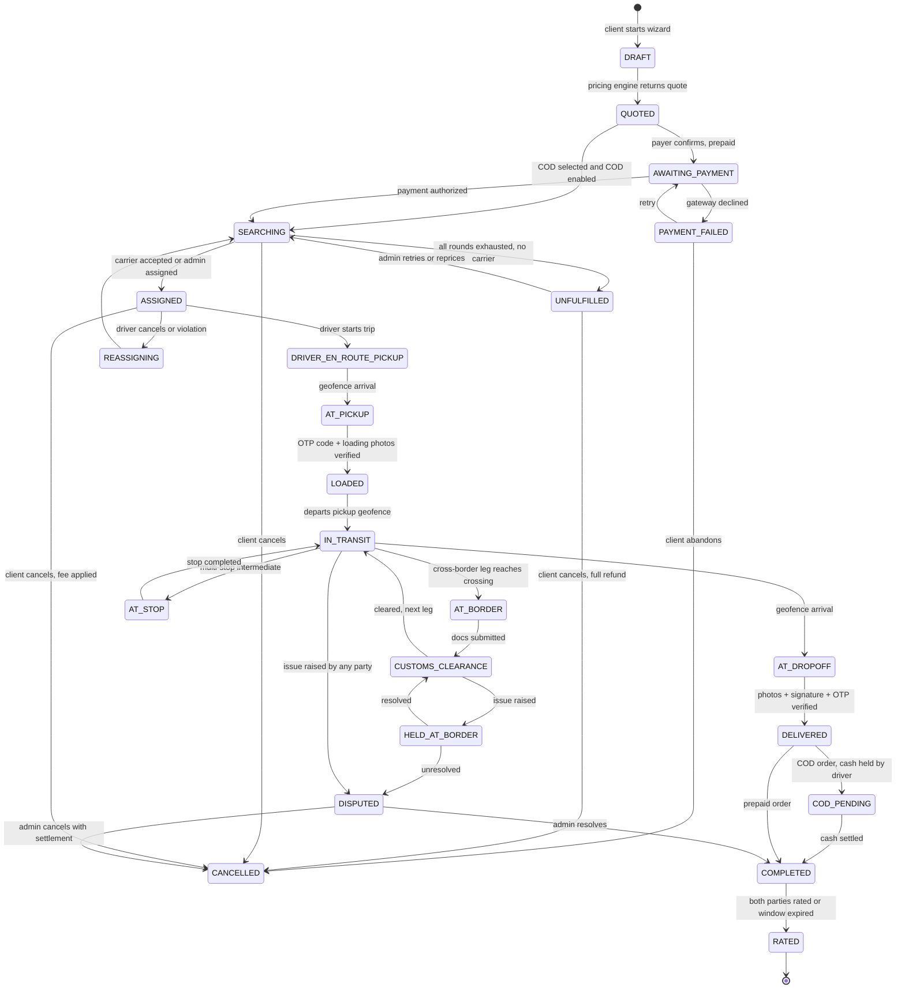
```mermaid
stateDiagram-v2
    [*] --> DRAFT: client starts wizard
    DRAFT --> QUOTED: pricing engine returns quote
    QUOTED --> AWAITING_PAYMENT: payer confirms, prepaid
    QUOTED --> SEARCHING: COD selected and COD enabled
    AWAITING_PAYMENT --> SEARCHING: payment authorized
    AWAITING_PAYMENT --> PAYMENT_FAILED: gateway declined
    PAYMENT_FAILED --> AWAITING_PAYMENT: retry
    PAYMENT_FAILED --> CANCELLED: client abandons

    SEARCHING --> ASSIGNED: carrier accepted or admin assigned
    SEARCHING --> UNFULFILLED: all rounds exhausted, no carrier
    UNFULFILLED --> SEARCHING: admin retries or reprices
    UNFULFILLED --> CANCELLED: client cancels, full refund

    ASSIGNED --> DRIVER_EN_ROUTE_PICKUP: driver starts trip
    DRIVER_EN_ROUTE_PICKUP --> AT_PICKUP: geofence arrival
    AT_PICKUP --> LOADED: OTP code + loading photos verified
    LOADED --> IN_TRANSIT: departs pickup geofence

    IN_TRANSIT --> AT_BORDER: cross-border leg reaches crossing
    AT_BORDER --> CUSTOMS_CLEARANCE: docs submitted
    CUSTOMS_CLEARANCE --> IN_TRANSIT: cleared, next leg
    CUSTOMS_CLEARANCE --> HELD_AT_BORDER: issue raised
    HELD_AT_BORDER --> CUSTOMS_CLEARANCE: resolved
    HELD_AT_BORDER --> DISPUTED: unresolved

    IN_TRANSIT --> AT_STOP: multi-stop intermediate
    AT_STOP --> IN_TRANSIT: stop completed
    IN_TRANSIT --> AT_DROPOFF: geofence arrival
    AT_DROPOFF --> DELIVERED: photos + signature + OTP verified
    DELIVERED --> COD_PENDING: COD order, cash held by driver
    COD_PENDING --> COMPLETED: cash settled
    DELIVERED --> COMPLETED: prepaid order
    COMPLETED --> RATED: both parties rated or window expired
    RATED --> [*]

    ASSIGNED --> REASSIGNING: driver cancels or violation
    REASSIGNING --> SEARCHING
    SEARCHING --> CANCELLED: client cancels
    ASSIGNED --> CANCELLED: client cancels, fee applied
    IN_TRANSIT --> DISPUTED: issue raised by any party
    DISPUTED --> COMPLETED: admin resolves
    DISPUTED --> CANCELLED: admin cancels with settlement
```

### 9.1 Order creation wizard (client app, 7 steps)

| Step | Content | Validation |
|---|---|---|
| 1 | Vehicle category (Short / Long / Port / by distance band) | must match country catalog |
| 2 | Vehicle type (box, flatbed, trailer, refrigerated, tanker, dump) | capacity vs weight guard |
| 3 | Route: pickup, drop-off, add stops, date/time or ASAP | distance & country detection, corridor validity |
| 4 | Sender contact + receiver contact per stop, notes | phone format per country |
| 5 | Cargo: type, weight, dimensions, description, special handling | weight ≤ vehicle capacity, restricted cargo check |
| 6 | Summary + price breakdown | quote generated and locked for N minutes |
| 7 | Payer (sender/receiver), payment method, cancellation policy consent | payment or COD availability by country |

**Capacity guard** (seen in the designs): when entered weight exceeds selected vehicle capacity, the app blocks "Continue", shows an inline warning, and offers a one-tap "choose a bigger truck" shortcut.

### 9.2 Proof of pickup & delivery

| Stage | Required |
|---|---|
| Pickup | driver inside geofence, 4-digit code from sender, ≥1 loading photo, timestamp + GPS |
| Intermediate stop | arrival geofence, optional photo, contact confirmation |
| Delivery | driver inside geofence, ≥1 unloading photo, receiver signature, 4-digit code, timestamp + GPS |

Every proof stores GPS, accuracy, device time vs server time, and a mock-location flag. Any mismatch raises a violation for review instead of blocking the driver in the field.

---

## 10. Dispatch Engine

Hybrid model: auto-broadcast first, manual fallback always available.

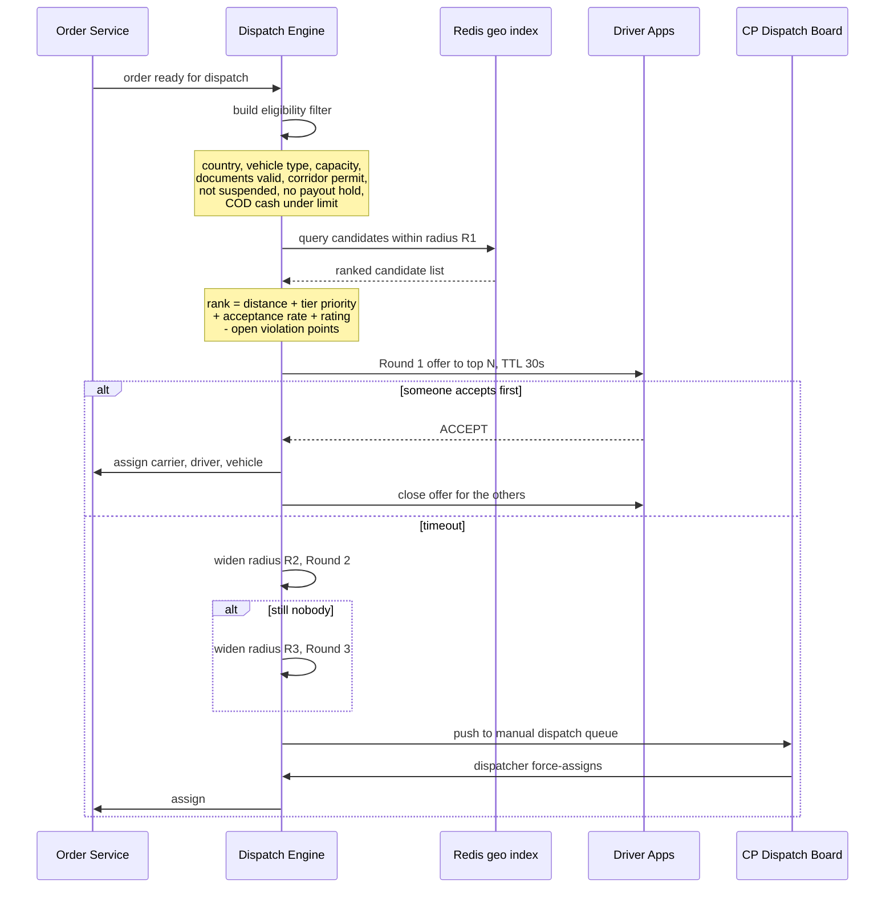
```mermaid
sequenceDiagram
    participant O as Order Service
    participant D as Dispatch Engine
    participant R as Redis geo index
    participant DR as Driver Apps
    participant CP as CP Dispatch Board

    O->>D: order ready for dispatch
    D->>D: build eligibility filter
    Note over D: country, vehicle type, capacity,<br/>documents valid, corridor permit,<br/>not suspended, no payout hold,<br/>COD cash under limit
    D->>R: query candidates within radius R1
    R-->>D: ranked candidate list
    Note over D: rank = distance + tier priority<br/>+ acceptance rate + rating<br/>- open violation points
    D->>DR: Round 1 offer to top N, TTL 30s
    alt someone accepts first
        DR-->>D: ACCEPT
        D->>O: assign carrier, driver, vehicle
        D->>DR: close offer for the others
    else timeout
        D->>D: widen radius R2, Round 2
        alt still nobody
            D->>D: widen radius R3, Round 3
        end
        D->>CP: push to manual dispatch queue
        CP->>D: dispatcher force-assigns
        D->>O: assign
    end
```

### 10.1 Rules

- **First accept wins.** Acceptance is an atomic DB operation (`UPDATE ... WHERE status='SEARCHING'`), so concurrent accepts cannot double-assign.
- **Offer rounds** are configurable per country: radius list, offer TTL, drivers per round, max rounds.
- **Fleet routing:** an order can be offered to a fleet at company level. A `FLEET_DISPATCHER` accepts, then assigns one of the company's drivers within a configurable window; if not assigned in time, the order returns to the pool.
- **Broker routing:** brokers see a claimable board of eligible orders. On claim, the broker becomes the responsible carrier and assigns one of its contracted carriers. The broker margin is recorded as a separate ledger entry, so client price, carrier payout, broker margin, and platform commission are all traceable.
- **Scheduled orders** enter the dispatch pipeline at `scheduled_at - lead_time`, where lead time is per country and per distance band.
- **Auto re-dispatch:** if a driver cancels after acceptance, the order returns to `SEARCHING` with a priority flag, and the driver receives a cancellation violation.
- **Ranking transparency:** every offer stores its computed score components, so support can explain why a driver did or did not receive an order.

---

## 11. Pricing Engine

Nothing is hardcoded. Every number below is a row in the database, editable in CP, versioned, and scoped by country.

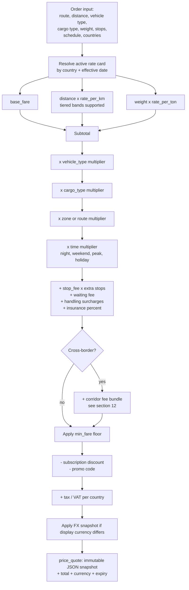
```mermaid
flowchart TD
    IN["Order input:<br/>route, distance, vehicle type,<br/>cargo type, weight, stops,<br/>schedule, countries"] --> RC["Resolve active rate card<br/>by country + effective date"]
    RC --> BASE["base_fare"]
    RC --> DIST["distance x rate_per_km<br/>tiered bands supported"]
    RC --> WGT["weight x rate_per_ton"]
    BASE --> SUM1["Subtotal"]
    DIST --> SUM1
    WGT --> SUM1
    SUM1 --> VM["x vehicle_type multiplier"]
    VM --> CM["x cargo_type multiplier"]
    CM --> ZM["x zone or route multiplier"]
    ZM --> TM["x time multiplier<br/>night, weekend, peak, holiday"]
    TM --> ADD["+ stop_fee x extra stops<br/>+ waiting fee<br/>+ handling surcharges<br/>+ insurance percent"]
    ADD --> XB{"Cross-border?"}
    XB -->|yes| COR["+ corridor fee bundle<br/>see section 12"]
    XB -->|no| MIN
    COR --> MIN["Apply min_fare floor"]
    MIN --> DISC["- subscription discount<br/>- promo code"]
    DISC --> TAX["+ tax / VAT per country"]
    TAX --> FX["Apply FX snapshot if display currency differs"]
    FX --> QUOTE["price_quote: immutable JSON snapshot<br/>+ total + currency + expiry"]
```

### 11.1 Factor catalog (all CP-managed)

| Factor group | Examples |
|---|---|
| Base | `base_fare`, `min_fare`, `included_km`, `included_waiting_minutes` |
| Distance | `rate_per_km` with optional tiered bands (0–50, 50–200, 200+) |
| Weight | `rate_per_ton`, `overweight_surcharge` |
| Vehicle | multiplier per vehicle type, per capacity class |
| Cargo | multiplier per cargo type, restricted-cargo surcharge, refrigeration surcharge |
| Geography | zone-pair multiplier, remote-area surcharge, port/airport access fee |
| Time | night, weekend, public holiday, peak-hour multipliers; scheduled-order discount |
| Stops | `stop_fee`, free stops included, per-stop waiting allowance |
| Waiting | `waiting_fee_per_hour` at pickup / drop-off / border |
| Risk | cargo insurance %, declared-value fee |
| Commercial | platform commission %, service fee, cancellation fee %, promo codes |
| Tax | VAT % per country, tax-inclusive or exclusive flag |

### 11.2 Rules

- **Versioning:** a rate card has `version`, `effective_from`, `effective_to`. Editing creates a new version; running orders keep the version they were quoted with.
- **Immutability:** the full computed breakdown is stored as JSON on `price_quotes`. The client sees exactly the same breakdown at order time, in the CP, and in the invoice — forever.
- **Quote expiry:** a quote is valid for a configurable window (default 15 min). Expired quotes are recalculated before payment.
- **Simulation tool in CP:** admins can enter a hypothetical route and see the resulting price and the exact factor contributions before publishing a new rate card version.
- **Dry-run diff:** publishing a new version shows the average price change against the last 1,000 orders, so pricing mistakes are caught before going live.
- **Manual repricing:** `ADMIN` can override a price with a mandatory reason; this is a separate ledger adjustment, never a silent edit.

---

## 12. Cross-Border Shipments

A shipment is modelled as **legs**. Domestic = 1 leg. Cross-border = one leg per country plus a crossing between them.

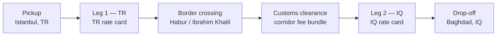
```mermaid
flowchart LR
    P["Pickup<br/>Istanbul, TR"] --> L1["Leg 1 — TR<br/>TR rate card"]
    L1 --> BX["Border crossing<br/>Habur / Ibrahim Khalil"]
    BX --> CUST["Customs clearance<br/>corridor fee bundle"]
    CUST --> L2["Leg 2 — IQ<br/>IQ rate card"]
    L2 --> D["Drop-off<br/>Baghdad, IQ"]
```

### 12.1 Seeded corridors

| Corridor | Main crossing(s) |
|---|---|
| Turkey ↔ Iraq | Habur–Ibrahim Khalil, Ovaköy |
| Iraq ↔ Jordan | Trebil – Karama |
| Iraq ↔ Kuwait | Safwan – Abdali |
| Iraq ↔ Iran | Mehran, Shalamcheh, Parvizkhan |
| Iraq ↔ Saudi Arabia | Arar / Jadidat Arar |
| Iraq ↔ Syria | Al-Qaim – Albu Kamal |
| Jordan ↔ Saudi Arabia | Al Haditha, Al Durra |
| Jordan ↔ Syria | Jaber – Nassib |
| Saudi Arabia ↔ UAE | Al Batha |
| Saudi Arabia ↔ Bahrain | King Fahd Causeway |
| UAE ↔ Oman | Hatta, Al Ain – Buraimi |

Corridors are data, not code — new ones are added in CP.

### 12.2 Corridor fee bundle (per corridor, vehicle type, cargo type)

`customs_clearance` · `border_entry_fee` · `transit_permit` · `escort_or_convoy_fee` · `border_waiting_per_day` · `cargo_insurance_percent` · `documents_fee` · `driver_entry_or_visa_fee` · `scanner_or_inspection_fee` · `agent_commission`

Each row carries its own currency and effective dates. Total cross-border price:

```
total = (origin_rate_card × origin_segment)
      + (destination_rate_card × destination_segment)
      + corridor_fee_bundle
      + platform_fee
      → converted with FX snapshot → settlement currency (pickup country)
```

### 12.3 Eligibility & documents

Only carriers meeting **all** of these receive a cross-border offer:

- valid cross-border transport permit for the corridor
- driver passport valid ≥ configurable days
- vehicle plate country allowed on that corridor
- vehicle documents (licence, insurance, technical inspection) valid through the expected trip window
- carrier not suspended and no active border-related violation

Per corridor, CP defines a **required document checklist** — commercial invoice, packing list, manifest, certificate of origin, TIR carnet, veterinary/health certificate, dangerous-goods declaration. The driver uploads them at the `AT_BORDER` state; an admin verifies before the order can move to the next leg.

### 12.4 Truck changes at the border

Per your decision: **one truck end-to-end**; if a swap is required, the **carrier is responsible** for it.

To keep tracking and proof intact, the platform still records a **custody handover event** when the carrier changes the assigned vehicle or driver mid-order:

- old vehicle/driver, new vehicle/driver, location, timestamp, reason
- handover photos of the cargo
- the tracking timeline shows the change to the client instead of the GPS trail silently jumping
- the carrier contract and the price stay unchanged; payout still goes to the same carrier

This costs little to build and prevents disputes where cargo condition changes between trucks.

---

## 13. Payments, Wallet, COD & Payouts

### 13.1 Payment flow

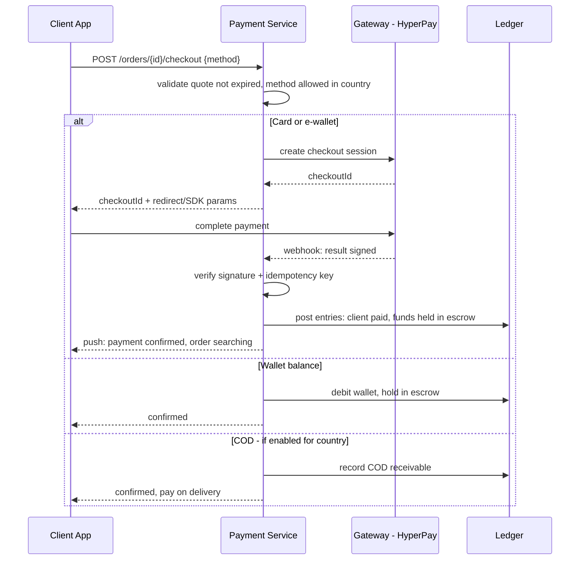
```mermaid
sequenceDiagram
    participant C as Client App
    participant API as Payment Service
    participant PG as Gateway - HyperPay
    participant L as Ledger

    C->>API: POST /orders/{id}/checkout {method}
    API->>API: validate quote not expired, method allowed in country
    alt Card or e-wallet
        API->>PG: create checkout session
        PG-->>API: checkoutId
        API-->>C: checkoutId + redirect/SDK params
        C->>PG: complete payment
        PG-->>API: webhook: result signed
        API->>API: verify signature + idempotency key
        API->>L: post entries: client paid, funds held in escrow
        API-->>C: push: payment confirmed, order searching
    else Wallet balance
        API->>L: debit wallet, hold in escrow
        API-->>C: confirmed
    else COD - if enabled for country
        API->>L: record COD receivable
        API-->>C: confirmed, pay on delivery
    end
```

### 13.2 Money model — double-entry ledger

Every movement is two balanced entries. Accounts: `client_wallet`, `carrier_wallet`, `platform_revenue`, `escrow`, `cod_receivable`, `payout_clearing`, `tax_payable`, `broker_margin`, `refunds`.

Example — completed prepaid order of 500,000 IQD, 15% commission:

| Entry | Debit | Credit |
|---|---|---|
| Client pays | escrow 500,000 | client 500,000 |
| Order completed | escrow 500,000 | carrier_wallet 425,000 + platform_revenue 75,000 |
| Carrier payout | carrier_wallet 425,000 | payout_clearing 425,000 |

Benefit: every balance is reconstructable, and every number in reports is provable.

### 13.3 Cash on Delivery

- Globally toggleable **per country** from CP. Disabled at launch, fully implemented.
- On delivery, the driver holds cash. `cod_collections` row is created: amount, driver, order, status `HELD`.
- Settlement methods (both implemented, both CP-toggleable): **bank deposit** (driver uploads deposit slip → finance verifies → status `SETTLED`) and **office hand-in** (office staff records receipt in CP → `SETTLED`).
- **Cash exposure limit** per country/tier: when a driver's unsettled cash exceeds the limit, dispatch stops offering him COD orders (or all orders — configurable), and a reminder violation is raised after a configurable grace period.
- Commission on COD orders is deducted from the driver's next payout, not collected in cash.

### 13.4 Payouts

- **No fixed payout day.** Carriers request payouts on demand; the system also auto-releases when a configurable threshold is met.
- Rules per country: minimum payout amount, maximum per day, hold period after delivery (dispute window), required verified payout account.
- Approval: below auto-approve limit → automatic; above → `FINANCE`/`ADMIN` approval.
- **Blocked** when: payout hold from a violation, unverified account, unsettled COD over the limit, or an open dispute on included orders.

**Payout methods per country** (adapter pattern, `PayoutProvider`):

| Country | Methods |
|---|---|
| Iraq | Bank/IBAN, ZainCash, FastPay, Qi Card, wallet-to-wallet |
| Jordan | Bank/IBAN, CliQ, eFAWATEERcom, wallet-to-wallet |
| Saudi Arabia | Bank/IBAN (SARIE), STC Pay, wallet-to-wallet |
| UAE | Bank/IBAN, wallet-to-wallet |
| Turkey | Bank/IBAN, wallet-to-wallet |

Each method defines its own required account fields (IBAN, wallet phone, alias), validation regex, fee, and processing time — all as configuration, so adding a rail means adding a row plus one adapter class.

### 13.5 Refunds & cancellation

| Case | Result |
|---|---|
| Client cancels before assignment | full refund, no fee |
| Client cancels after assignment, before pickup | cancellation fee % (default 5%) retained, rest refunded |
| Client cancels after pickup | admin-reviewed settlement: distance travelled + waiting |
| Driver cancels | full refund to client, violation to driver, order re-dispatched |
| Order unfulfilled | full refund, no fee |
| Dispute | funds stay in escrow until admin resolves |

---

## 14. Subscriptions & Carrier Tiers

### 14.1 Client subscription plans

| | Free | Plus | Business |
|---|---|---|---|
| Service fee discount | 0% | configurable | configurable |
| Free cancellations / month | 1 | 3 | 10 |
| Priority dispatch weight | ×1.0 | ×1.1 | ×1.25 |
| Saved addresses | 5 | 25 | unlimited |
| Sub-users | — | — | configurable |
| Scheduled orders | ✅ | ✅ | ✅ |
| Multi-stop max stops | 2 | 5 | configurable |
| Postpaid monthly invoicing | ❌ | ❌ | ✅ with credit limit |
| Dedicated support | ❌ | ✅ | ✅ |
| API access | ❌ | ❌ | ✅ |
| Custom reports | ❌ | ❌ | ✅ |

**Every benefit row is a CP toggle with a value.** Plans, prices, currencies, and benefit values are per country. Billing is monthly/annual through the same gateway, with grace period, dunning retries, and automatic downgrade to Free on failure.

### 14.2 Carrier earned tiers

Tiers are computed, not bought. Score is a weighted sum of CP-configured metrics over a rolling window:

| Metric | Direction |
|---|---|
| Completed orders | ↑ |
| Acceptance rate | ↑ |
| On-time pickup % | ↑ |
| On-time delivery % | ↑ |
| Average rating | ↑ |
| Revenue generated | ↑ |
| Cancellation rate | ↓ |
| Open violation points | ↓ |
| Document compliance | ↑ |

| Tier | Typical effect (all configurable) |
|---|---|
| Bronze | base commission, standard dispatch priority |
| Silver | −1% commission, ×1.1 priority |
| Gold | −2% commission, ×1.25 priority, faster payout release |
| Platinum | −3% commission, ×1.4 priority, instant payouts, cross-border priority, higher cash limit |

Recalculated on a schedule (default nightly). Tier changes notify the carrier with the reason. `ADMIN` can pin a tier manually with a reason and expiry.

---

## 15. Violation & Compliance Engine

Rules are data. Detection is automatic. **Warnings and priority drops apply automatically; suspension and deactivation require admin confirmation.**

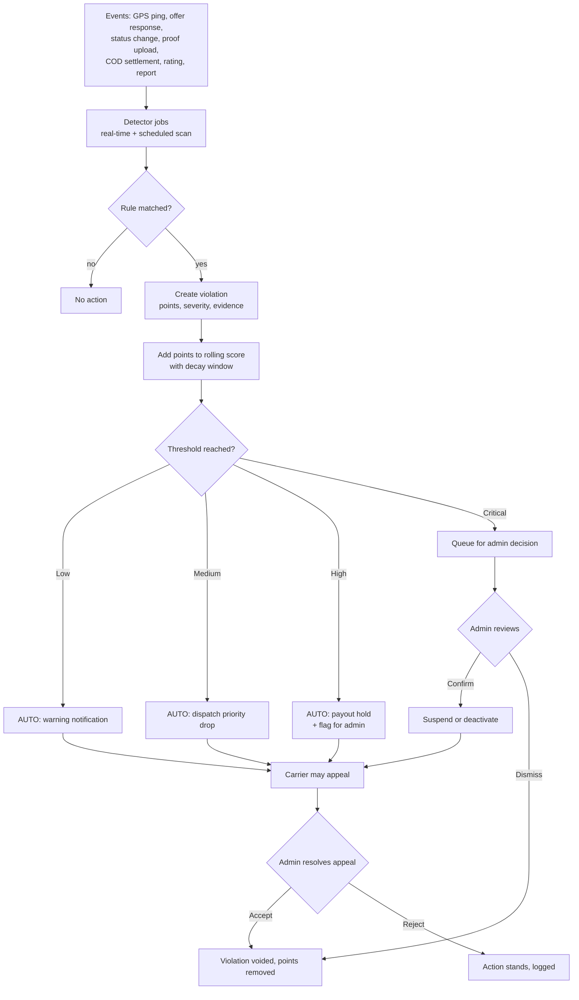
```mermaid
flowchart TD
    EV["Events: GPS ping, offer response,<br/>status change, proof upload,<br/>COD settlement, rating, report"] --> DET["Detector jobs<br/>real-time + scheduled scan"]
    DET --> MATCH{"Rule matched?"}
    MATCH -->|no| END["No action"]
    MATCH -->|yes| V["Create violation<br/>points, severity, evidence"]
    V --> SCORE["Add points to rolling score<br/>with decay window"]
    SCORE --> LEVEL{"Threshold reached?"}
    LEVEL -->|Low| A1["AUTO: warning notification"]
    LEVEL -->|Medium| A2["AUTO: dispatch priority drop"]
    LEVEL -->|High| A3["AUTO: payout hold<br/>+ flag for admin"]
    LEVEL -->|Critical| Q["Queue for admin decision"]
    Q --> ADM{"Admin reviews"}
    ADM -->|Confirm| A4["Suspend or deactivate"]
    ADM -->|Dismiss| A5["Violation voided, points removed"]
    A1 --> APP["Carrier may appeal"]
    A2 --> APP
    A3 --> APP
    A4 --> APP
    APP --> ADM2{"Admin resolves appeal"}
    ADM2 -->|Accept| A5
    ADM2 -->|Reject| KEEP["Action stands, logged"]
```

### 15.1 Detected violations

| Group | Rule | Signal |
|---|---|---|
| Offers | low acceptance rate | accepted / offered below threshold in window |
| Offers | ignoring offers | N consecutive expired offers |
| Offers | offline right after accepting | availability off within X min of accept |
| Trip | cancel after accept | driver-initiated cancellation |
| Trip | late pickup / late delivery | actual vs promised ETA beyond tolerance |
| Trip | route deviation | distance from planned polyline > X km for > Y min |
| Trip | unauthorized long stop | stationary > X min outside stop geofences |
| Trip | GPS gap | no ping for > X min while `IN_TRANSIT` |
| Trip | over-speed | speed > country limit sustained for > X sec |
| Trip | mock location | OS mock-location flag or impossible jump |
| Proof | missing proof | delivered without required photo/signature |
| Proof | out-of-geofence completion | delivery marked outside the drop-off geofence |
| Proof | OTP brute force | N wrong verification codes |
| Money | COD not settled | unsettled cash beyond grace period |
| Money | cash exposure exceeded | unsettled total above limit |
| Documents | expired document used | trip started with expired licence/insurance |
| Conduct | rating streak | N consecutive ratings below threshold |
| Conduct | reported abuse | client report or flagged chat content |
| Border | missing customs documents | corridor checklist incomplete at border |

### 15.2 Mechanics

- Each rule: `code`, `country_scope`, `enabled`, `threshold`, `window`, `points`, `severity`, `auto_action`, `grace_period`.
- Points **decay** after the window, so an old mistake stops punishing a good carrier.
- Every violation stores **evidence JSON** — GPS trail excerpt, timestamps, order ref, screenshots — so appeals are decided on facts.
- Repeat escalation: the same rule triggering repeatedly increases severity automatically.
- The violation score feeds the tier score, so compliance and earnings are directly linked.
- Fleet drivers' violations aggregate to the **company** as well, with its own thresholds.
- Every automatic action is logged and reversible; dismissed violations remove their points retroactively.

---

## 16. Chat, Notifications & Real-Time

### 16.1 Chat

- Scope: per order. Participants: client ↔ driver, and admin/support can join any conversation.
- Message types: **text, image, voice note** — all supported.
- **Full history retained for disputes.** Messages are never hard-deleted; a deleted message is soft-flagged and still visible to support with the original content.
- Phone numbers are masked in chat when the order is not yet in an active state, and the public tracking page never exposes personal numbers.
- Media on S3/MinIO with short-lived signed URLs. Voice notes: Opus/AAC, max duration configurable.
- Delivery states: sent / delivered / read. Offline messages are queued and pushed via FCM.
- Content moderation hooks: flagged keywords raise a support ticket and can create a conduct violation.

### 16.2 Real-time channels (STOMP over WebSocket)

| Topic | Direction | Payload |
|---|---|---|
| `/user/queue/offers` | server → driver | new offer, TTL countdown, cancel |
| `/topic/order/{id}/location` | driver → server → subscribers | lat, lng, heading, speed, accuracy, ts |
| `/topic/order/{id}/status` | server → all | state change + i18n key |
| `/topic/order/{id}/chat` | bidirectional | messages, typing, read receipts |
| `/topic/admin/dispatch` | server → CP | live board updates |
| `/topic/admin/fleet` | server → CP | live driver map positions |
| `/user/queue/notifications` | server → user | in-app notifications |

Location strategy: driver app posts GPS every 10–15 s while on an active trip (adaptive by speed and battery), buffers offline and replays on reconnect. Redis holds the live position; MySQL keeps a downsampled trail for history and violation evidence.

### 16.3 Notifications

- Channels: FCM push, in-app inbox, SMS (critical only), email (invoices/statements).
- **Templates are translation keys with parameters**, rendered in the recipient's language at send time.
- Per-user preferences by category. Quiet hours per country.
- Categories: order lifecycle, offers, payments, payouts, subscription, tier changes, violations, documents, chat, marketing.
- Deep links carry the target screen so a push opens the exact order.
- **SOS:** driver presses SOS → alert with live location to CP + configured emergency contacts, opens a high-priority ticket, and stays visible on the live map until resolved.

---

## 17. Ratings & Public Tracking

### 17.1 Ratings

- Two-way: client rates driver, driver rates client. 1–5 stars plus optional tag reasons and comment.
- Rating window configurable (default 7 days); unrated orders close automatically.
- Ratings are visible after both sides submit or the window closes, to avoid retaliation.
- Driver rating is a rolling average over the last N orders, feeding both tier score and violation rules.
- Clients with repeated low driver-ratings can be flagged in CP.

### 17.2 Public tracking link

The share action on the order screen creates a tokenized public URL: `https://track.nextfreight.app/t/{opaque-token}`.

Security rules:

- Random 128-bit opaque token, not the order id, unguessable and not enumerable.
- **Auto-disabled the moment the order is delivered** — the page then shows only "delivered" with the date.
- **No personal phone numbers** shown: no driver phone, no client phone, no receiver phone.
- Shows only: order code, status timeline, vehicle type and masked plate, live map position while in transit, ETA, pickup/drop-off city (not full address).
- Rate-limited, `noindex`, no session, revocable from CP or by the client at any time.

---

## 18. Database Design

MySQL 8, InnoDB, `utf8mb4_0900_ai_ci`. All money as `BIGINT` minor units + `currency_code`. All timestamps UTC. Soft delete via `deleted_at` on user-facing entities. Flyway migrations.

### 18.1 ERD — Identity, Organizations & Catalog

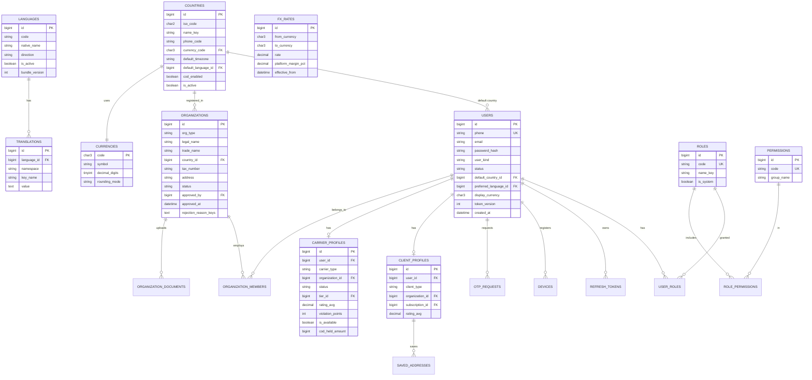
```mermaid
erDiagram
    COUNTRIES ||--o{ USERS : "default country"
    COUNTRIES ||--o{ ORGANIZATIONS : registered_in
    COUNTRIES ||--|| CURRENCIES : uses
    LANGUAGES ||--o{ TRANSLATIONS : has
    USERS ||--o{ USER_ROLES : has
    ROLES ||--o{ USER_ROLES : granted
    ROLES ||--o{ ROLE_PERMISSIONS : includes
    PERMISSIONS ||--o{ ROLE_PERMISSIONS : in
    USERS ||--o{ REFRESH_TOKENS : owns
    USERS ||--o{ DEVICES : registers
    USERS ||--o{ OTP_REQUESTS : requests
    USERS ||--o| CLIENT_PROFILES : has
    USERS ||--o| CARRIER_PROFILES : has
    ORGANIZATIONS ||--o{ ORGANIZATION_MEMBERS : employs
    USERS ||--o{ ORGANIZATION_MEMBERS : belongs_to
    ORGANIZATIONS ||--o{ ORGANIZATION_DOCUMENTS : uploads
    CLIENT_PROFILES ||--o{ SAVED_ADDRESSES : saves

    COUNTRIES {
        bigint id PK
        char2 iso_code
        string name_key
        string phone_code
        char3 currency_code FK
        string default_timezone
        bigint default_language_id FK
        boolean cod_enabled
        boolean is_active
    }
    CURRENCIES {
        char3 code PK
        string symbol
        tinyint decimal_digits
        string rounding_mode
    }
    FX_RATES {
        bigint id PK
        char3 from_currency
        char3 to_currency
        decimal rate
        decimal platform_margin_pct
        datetime effective_from
    }
    LANGUAGES {
        bigint id PK
        string code
        string native_name
        string direction
        boolean is_active
        int bundle_version
    }
    TRANSLATIONS {
        bigint id PK
        bigint language_id FK
        string namespace
        string key_name
        text value
    }
    USERS {
        bigint id PK
        string phone UK
        string email
        string password_hash
        string user_kind
        string status
        bigint default_country_id FK
        bigint preferred_language_id FK
        char3 display_currency
        int token_version
        datetime created_at
    }
    ROLES {
        bigint id PK
        string code UK
        string name_key
        boolean is_system
    }
    PERMISSIONS {
        bigint id PK
        string code UK
        string group_name
    }
    ORGANIZATIONS {
        bigint id PK
        string org_type
        string legal_name
        string trade_name
        bigint country_id FK
        string tax_number
        string address
        string status
        bigint approved_by FK
        datetime approved_at
        text rejection_reason_keys
    }
    CLIENT_PROFILES {
        bigint id PK
        bigint user_id FK
        string client_type
        bigint organization_id FK
        bigint subscription_id FK
        decimal rating_avg
    }
    CARRIER_PROFILES {
        bigint id PK
        bigint user_id FK
        string carrier_type
        bigint organization_id FK
        string status
        bigint tier_id FK
        decimal rating_avg
        int violation_points
        boolean is_available
        bigint cod_held_amount
    }
```

### 18.2 ERD — Fleet & Assets

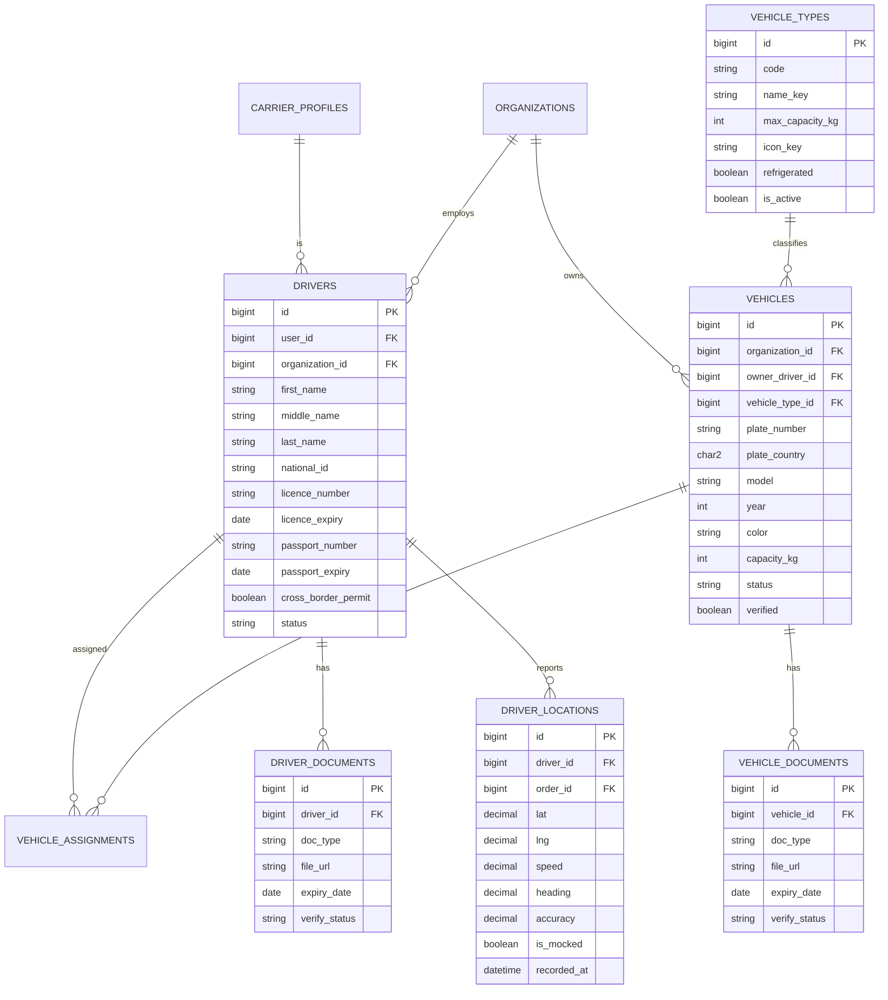
```mermaid
erDiagram
    CARRIER_PROFILES ||--o{ DRIVERS : is
    ORGANIZATIONS ||--o{ DRIVERS : employs
    ORGANIZATIONS ||--o{ VEHICLES : owns
    DRIVERS ||--o{ VEHICLE_ASSIGNMENTS : assigned
    VEHICLES ||--o{ VEHICLE_ASSIGNMENTS : assigned
    VEHICLE_TYPES ||--o{ VEHICLES : classifies
    VEHICLES ||--o{ VEHICLE_DOCUMENTS : has
    DRIVERS ||--o{ DRIVER_DOCUMENTS : has
    DRIVERS ||--o{ DRIVER_LOCATIONS : reports

    DRIVERS {
        bigint id PK
        bigint user_id FK
        bigint organization_id FK
        string first_name
        string middle_name
        string last_name
        string national_id
        string licence_number
        date licence_expiry
        string passport_number
        date passport_expiry
        boolean cross_border_permit
        string status
    }
    VEHICLES {
        bigint id PK
        bigint organization_id FK
        bigint owner_driver_id FK
        bigint vehicle_type_id FK
        string plate_number
        char2 plate_country
        string model
        int year
        string color
        int capacity_kg
        string status
        boolean verified
    }
    VEHICLE_TYPES {
        bigint id PK
        string code
        string name_key
        int max_capacity_kg
        string icon_key
        boolean refrigerated
        boolean is_active
    }
    VEHICLE_DOCUMENTS {
        bigint id PK
        bigint vehicle_id FK
        string doc_type
        string file_url
        date expiry_date
        string verify_status
    }
    DRIVER_DOCUMENTS {
        bigint id PK
        bigint driver_id FK
        string doc_type
        string file_url
        date expiry_date
        string verify_status
    }
    DRIVER_LOCATIONS {
        bigint id PK
        bigint driver_id FK
        bigint order_id FK
        decimal lat
        decimal lng
        decimal speed
        decimal heading
        decimal accuracy
        boolean is_mocked
        datetime recorded_at
    }
```

### 18.3 ERD — Orders, Legs & Proofs

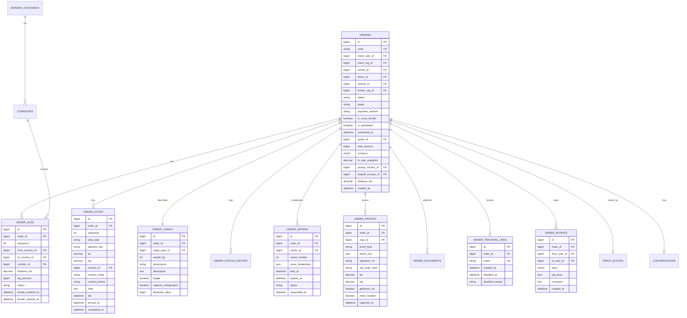
```mermaid
erDiagram
    ORDERS ||--o{ ORDER_STOPS : has
    ORDERS ||--o{ ORDER_LEGS : has
    ORDERS ||--|| ORDER_CARGO : describes
    ORDERS ||--o{ ORDER_STATUS_HISTORY : logs
    ORDERS ||--o{ ORDER_OFFERS : broadcasts
    ORDERS ||--o{ ORDER_PROOFS : proves
    ORDERS ||--o{ ORDER_DOCUMENTS : attaches
    ORDERS ||--o| ORDER_TRACKING_LINKS : shares
    ORDERS ||--o{ ORDER_RATINGS : rated
    ORDERS ||--o| PRICE_QUOTES : priced_by
    ORDERS ||--o| CONVERSATIONS : chat
    CORRIDORS ||--o{ ORDER_LEGS : crosses
    BORDER_CROSSINGS ||--o{ CORRIDORS : via

    ORDERS {
        bigint id PK
        string code UK
        bigint client_user_id FK
        bigint client_org_id FK
        bigint carrier_id FK
        bigint driver_id FK
        bigint vehicle_id FK
        bigint broker_org_id FK
        string status
        string payer
        string payment_method
        boolean is_cross_border
        boolean is_scheduled
        datetime scheduled_at
        bigint quote_id FK
        bigint total_amount
        char3 currency
        decimal fx_rate_snapshot
        bigint pickup_country_id FK
        bigint dropoff_country_id FK
        decimal distance_km
        datetime created_at
    }
    ORDER_STOPS {
        bigint id PK
        bigint order_id FK
        int sequence
        string stop_type
        string address_line
        decimal lat
        decimal lng
        bigint country_id FK
        string contact_name
        string contact_phone
        text note
        datetime eta
        datetime arrived_at
        datetime completed_at
    }
    ORDER_LEGS {
        bigint id PK
        bigint order_id FK
        int sequence
        bigint from_country_id FK
        bigint to_country_id FK
        bigint corridor_id FK
        decimal distance_km
        bigint leg_amount
        string status
        datetime border_entered_at
        datetime border_cleared_at
    }
    ORDER_CARGO {
        bigint id PK
        bigint order_id FK
        bigint cargo_type_id FK
        int weight_kg
        string dimensions
        text description
        boolean fragile
        boolean requires_refrigeration
        bigint declared_value
    }
    ORDER_OFFERS {
        bigint id PK
        bigint order_id FK
        bigint carrier_id FK
        int round_number
        json score_breakdown
        datetime sent_at
        datetime expires_at
        string status
        datetime responded_at
    }
    ORDER_PROOFS {
        bigint id PK
        bigint order_id FK
        bigint stop_id FK
        string proof_type
        json photo_urls
        string signature_url
        string otp_code_hash
        decimal lat
        decimal lng
        boolean geofence_ok
        boolean mock_location
        datetime captured_at
    }
    ORDER_TRACKING_LINKS {
        bigint id PK
        bigint order_id FK
        string token UK
        datetime created_at
        datetime disabled_at
        string disabled_reason
    }
    ORDER_RATINGS {
        bigint id PK
        bigint order_id FK
        bigint from_user_id FK
        bigint to_user_id FK
        tinyint stars
        json tag_keys
        text comment
        datetime created_at
    }
```

### 18.4 ERD — Pricing

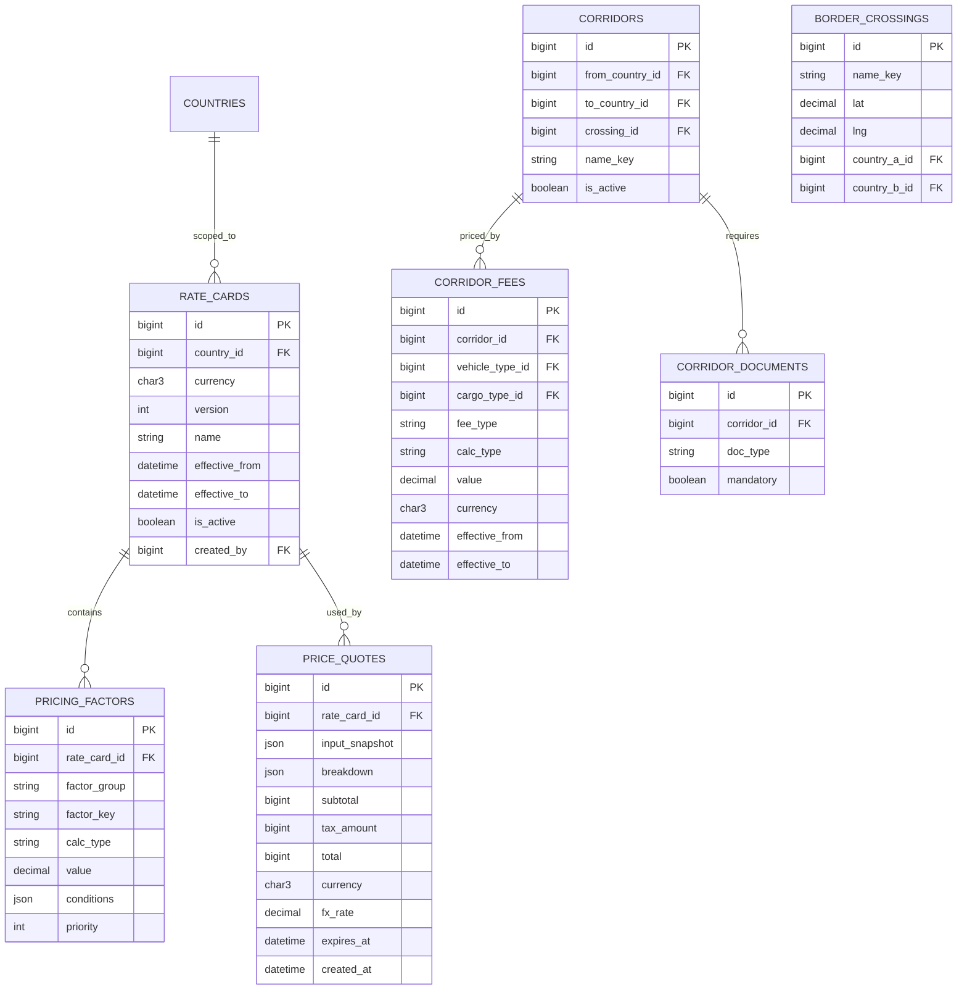
```mermaid
erDiagram
    RATE_CARDS ||--o{ PRICING_FACTORS : contains
    COUNTRIES ||--o{ RATE_CARDS : scoped_to
    RATE_CARDS ||--o{ PRICE_QUOTES : used_by
    CORRIDORS ||--o{ CORRIDOR_FEES : priced_by
    CORRIDORS ||--o{ CORRIDOR_DOCUMENTS : requires

    RATE_CARDS {
        bigint id PK
        bigint country_id FK
        char3 currency
        int version
        string name
        datetime effective_from
        datetime effective_to
        boolean is_active
        bigint created_by FK
    }
    PRICING_FACTORS {
        bigint id PK
        bigint rate_card_id FK
        string factor_group
        string factor_key
        string calc_type
        decimal value
        json conditions
        int priority
    }
    PRICE_QUOTES {
        bigint id PK
        bigint rate_card_id FK
        json input_snapshot
        json breakdown
        bigint subtotal
        bigint tax_amount
        bigint total
        char3 currency
        decimal fx_rate
        datetime expires_at
        datetime created_at
    }
    CORRIDORS {
        bigint id PK
        bigint from_country_id FK
        bigint to_country_id FK
        bigint crossing_id FK
        string name_key
        boolean is_active
    }
    BORDER_CROSSINGS {
        bigint id PK
        string name_key
        decimal lat
        decimal lng
        bigint country_a_id FK
        bigint country_b_id FK
    }
    CORRIDOR_FEES {
        bigint id PK
        bigint corridor_id FK
        bigint vehicle_type_id FK
        bigint cargo_type_id FK
        string fee_type
        string calc_type
        decimal value
        char3 currency
        datetime effective_from
        datetime effective_to
    }
    CORRIDOR_DOCUMENTS {
        bigint id PK
        bigint corridor_id FK
        string doc_type
        boolean mandatory
    }
```

### 18.5 ERD — Money

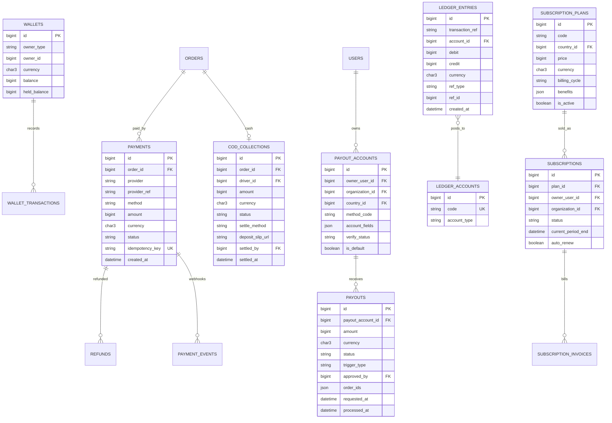
```mermaid
erDiagram
    WALLETS ||--o{ WALLET_TRANSACTIONS : records
    ORDERS ||--o{ PAYMENTS : paid_by
    PAYMENTS ||--o{ REFUNDS : refunded
    PAYMENTS ||--o{ PAYMENT_EVENTS : webhooks
    ORDERS ||--o| COD_COLLECTIONS : cash
    USERS ||--o{ PAYOUT_ACCOUNTS : owns
    PAYOUT_ACCOUNTS ||--o{ PAYOUTS : receives
    LEDGER_ENTRIES }o--|| LEDGER_ACCOUNTS : posts_to
    SUBSCRIPTION_PLANS ||--o{ SUBSCRIPTIONS : sold_as
    SUBSCRIPTIONS ||--o{ SUBSCRIPTION_INVOICES : bills

    WALLETS {
        bigint id PK
        string owner_type
        bigint owner_id
        char3 currency
        bigint balance
        bigint held_balance
    }
    PAYMENTS {
        bigint id PK
        bigint order_id FK
        string provider
        string provider_ref
        string method
        bigint amount
        char3 currency
        string status
        string idempotency_key UK
        datetime created_at
    }
    COD_COLLECTIONS {
        bigint id PK
        bigint order_id FK
        bigint driver_id FK
        bigint amount
        char3 currency
        string status
        string settle_method
        string deposit_slip_url
        bigint settled_by FK
        datetime settled_at
    }
    PAYOUT_ACCOUNTS {
        bigint id PK
        bigint owner_user_id FK
        bigint organization_id FK
        bigint country_id FK
        string method_code
        json account_fields
        string verify_status
        boolean is_default
    }
    PAYOUTS {
        bigint id PK
        bigint payout_account_id FK
        bigint amount
        char3 currency
        string status
        string trigger_type
        bigint approved_by FK
        json order_ids
        datetime requested_at
        datetime processed_at
    }
    LEDGER_ACCOUNTS {
        bigint id PK
        string code UK
        string account_type
    }
    LEDGER_ENTRIES {
        bigint id PK
        string transaction_ref
        bigint account_id FK
        bigint debit
        bigint credit
        char3 currency
        string ref_type
        bigint ref_id
        datetime created_at
    }
    SUBSCRIPTION_PLANS {
        bigint id PK
        string code
        bigint country_id FK
        bigint price
        char3 currency
        string billing_cycle
        json benefits
        boolean is_active
    }
    SUBSCRIPTIONS {
        bigint id PK
        bigint plan_id FK
        bigint owner_user_id FK
        bigint organization_id FK
        string status
        datetime current_period_end
        boolean auto_renew
    }
```

### 18.6 ERD — Compliance, Chat & Ops

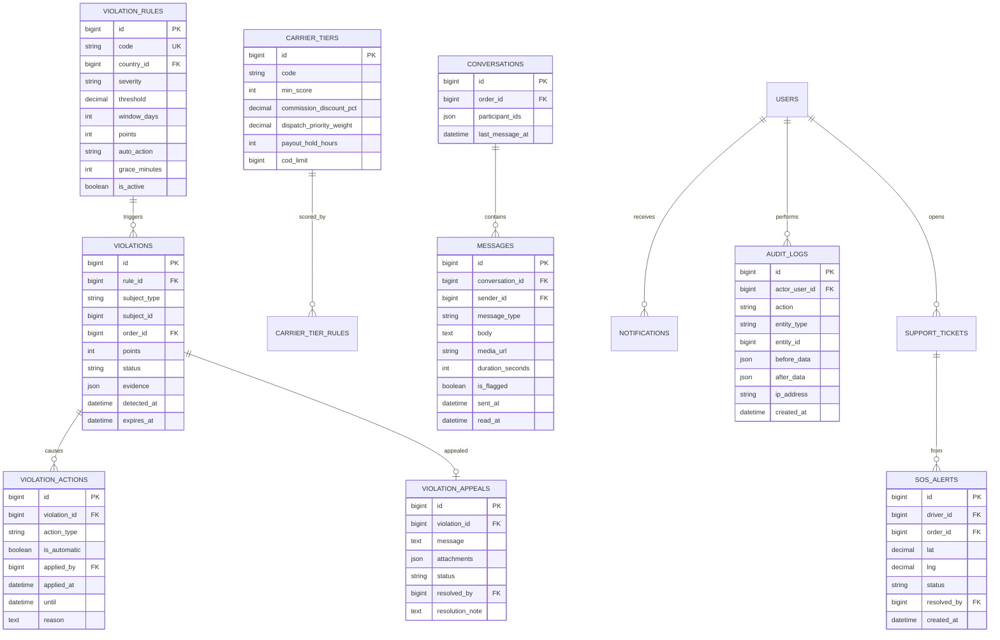
```mermaid
erDiagram
    VIOLATION_RULES ||--o{ VIOLATIONS : triggers
    VIOLATIONS ||--o{ VIOLATION_ACTIONS : causes
    VIOLATIONS ||--o| VIOLATION_APPEALS : appealed
    CARRIER_TIERS ||--o{ CARRIER_TIER_RULES : scored_by
    CONVERSATIONS ||--o{ MESSAGES : contains
    USERS ||--o{ NOTIFICATIONS : receives
    USERS ||--o{ AUDIT_LOGS : performs
    USERS ||--o{ SUPPORT_TICKETS : opens
    SUPPORT_TICKETS ||--o{ SOS_ALERTS : from

    VIOLATION_RULES {
        bigint id PK
        string code UK
        bigint country_id FK
        string severity
        decimal threshold
        int window_days
        int points
        string auto_action
        int grace_minutes
        boolean is_active
    }
    VIOLATIONS {
        bigint id PK
        bigint rule_id FK
        string subject_type
        bigint subject_id
        bigint order_id FK
        int points
        string status
        json evidence
        datetime detected_at
        datetime expires_at
    }
    VIOLATION_ACTIONS {
        bigint id PK
        bigint violation_id FK
        string action_type
        boolean is_automatic
        bigint applied_by FK
        datetime applied_at
        datetime until
        text reason
    }
    VIOLATION_APPEALS {
        bigint id PK
        bigint violation_id FK
        text message
        json attachments
        string status
        bigint resolved_by FK
        text resolution_note
    }
    CARRIER_TIERS {
        bigint id PK
        string code
        int min_score
        decimal commission_discount_pct
        decimal dispatch_priority_weight
        int payout_hold_hours
        bigint cod_limit
    }
    CONVERSATIONS {
        bigint id PK
        bigint order_id FK
        json participant_ids
        datetime last_message_at
    }
    MESSAGES {
        bigint id PK
        bigint conversation_id FK
        bigint sender_id FK
        string message_type
        text body
        string media_url
        int duration_seconds
        boolean is_flagged
        datetime sent_at
        datetime read_at
    }
    AUDIT_LOGS {
        bigint id PK
        bigint actor_user_id FK
        string action
        string entity_type
        bigint entity_id
        json before_data
        json after_data
        string ip_address
        datetime created_at
    }
    SOS_ALERTS {
        bigint id PK
        bigint driver_id FK
        bigint order_id FK
        decimal lat
        decimal lng
        string status
        bigint resolved_by FK
        datetime created_at
    }
```

### 18.7 Indexing & performance notes

| Table | Key indexes |
|---|---|
| `orders` | `(status, created_at)`, `(client_user_id, status)`, `(driver_id, status)`, `(carrier_id, status)`, `code` |
| `driver_locations` | `(order_id, recorded_at)`, `(driver_id, recorded_at)` — partitioned monthly, downsampled after 30 days |
| `order_offers` | `(order_id, round_number)`, `(carrier_id, status, sent_at)` |
| `ledger_entries` | `(transaction_ref)`, `(account_id, created_at)` |
| `violations` | `(subject_type, subject_id, status, expires_at)` |
| `messages` | `(conversation_id, sent_at)` |
| `translations` | unique `(language_id, namespace, key_name)` |

Live driver positions live in **Redis GEO**, not MySQL — MySQL only stores the historical trail.

---

## 19. REST API Reference

Base: `https://api.nextfreight.app/v1`
Headers: `Authorization: Bearer <jwt>` · `Accept-Language` · `X-Country-Code` · `X-Device-Id` · `X-App-Version` · `Idempotency-Key` on all money-moving POSTs.

Standard envelope:

```json
{
  "success": true,
  "data": { },
  "error": { "code": "ORDER_WEIGHT_EXCEEDS_CAPACITY", "messageKey": "error.order.weight_exceeds", "params": {"max": 10000} },
  "meta": { "page": 1, "size": 20, "total": 134 }
}
```

Errors always return a **key + params**, never a translated sentence — the client renders it in the active language.

### 19.1 Public & bootstrap

| Method | Path | Auth | Purpose |
|---|---|---|---|
| GET | `/config/bootstrap` | none | countries, feature flags, min app version, force-update |
| GET | `/i18n/languages` | none | language list with direction and bundle version |
| GET | `/i18n/bundle?lang=&version=` | none | translation bundle, delta supported |
| GET | `/catalog/countries` | none | active countries + currency + phone code |
| GET | `/catalog/vehicle-types?country=` | none | vehicle catalog |
| GET | `/catalog/cargo-types?country=` | none | cargo catalog |
| GET | `/track/{token}` | none | public tracking payload, no phone numbers |

### 19.2 Auth

| Method | Path | Auth | Purpose |
|---|---|---|---|
| POST | `/auth/otp/request` | none | send OTP |
| POST | `/auth/otp/verify` | none | verify, issue tokens |
| POST | `/auth/refresh` | refresh | rotate tokens |
| POST | `/auth/logout` | user | revoke current session |
| GET | `/auth/sessions` | user | list devices |
| DELETE | `/auth/sessions/{id}` | user | revoke a device |
| POST | `/auth/cp/login` | none | CP email + password |
| POST | `/auth/cp/2fa/verify` | partial | TOTP |
| GET | `/me` | user | profile, roles, permissions, tier, subscription |
| PATCH | `/me` | user | update profile, language, display currency |

### 19.3 Registration & approval

| Method | Path | Auth | Role |
|---|---|---|---|
| POST | `/registration/client` | otp-verified | — |
| POST | `/registration/carrier/driver` | otp-verified | — |
| POST | `/registration/carrier/fleet` | otp-verified | — |
| POST | `/registration/carrier/broker` | otp-verified | — |
| PATCH | `/registration/{id}/step/{n}` | limited | auto-save a wizard step |
| POST | `/registration/{id}/documents` | limited | upload document |
| POST | `/registration/{id}/submit` | limited | submit for review |
| GET | `/registration/{id}/status` | limited | status + reason keys |
| GET | `/admin/applications` | cp | `carrier.approve` |
| POST | `/admin/applications/{id}/approve` | cp | `carrier.approve` |
| POST | `/admin/applications/{id}/request-changes` | cp | `carrier.approve` |
| POST | `/admin/applications/{id}/reject` | cp | `carrier.approve` |

### 19.4 Orders — client

| Method | Path | Purpose |
|---|---|---|
| POST | `/orders/quote` | price a draft, returns breakdown + quote id + expiry |
| POST | `/orders` | create from a valid quote |
| GET | `/orders?status=&page=` | list own orders |
| GET | `/orders/{id}` | full detail |
| POST | `/orders/{id}/checkout` | pay or select COD |
| POST | `/orders/{id}/cancel` | cancel, returns applied fee |
| POST | `/orders/{id}/tracking-link` | create public link |
| DELETE | `/orders/{id}/tracking-link` | revoke |
| GET | `/orders/{id}/tracking` | live position + ETA |
| POST | `/orders/{id}/rate` | rate the driver |
| GET | `/addresses` · POST · PATCH · DELETE | saved addresses |

### 19.5 Orders — driver

| Method | Path | Purpose |
|---|---|---|
| POST | `/driver/availability` | go online/offline |
| GET | `/driver/offers` | pending offers |
| POST | `/driver/offers/{id}/accept` | accept, atomic |
| POST | `/driver/offers/{id}/reject` | reject |
| GET | `/driver/orders/active` | current job |
| POST | `/driver/orders/{id}/start` | begin trip |
| POST | `/driver/orders/{id}/arrived/{stopId}` | geofence arrival |
| POST | `/driver/orders/{id}/pickup` | OTP + photos |
| POST | `/driver/orders/{id}/stop/{stopId}/complete` | intermediate stop |
| POST | `/driver/orders/{id}/border/documents` | upload customs docs |
| POST | `/driver/orders/{id}/deliver` | photos + signature + OTP |
| POST | `/driver/location` | GPS batch |
| GET | `/driver/earnings?range=` | earnings summary |
| GET | `/driver/history` | completed orders |
| POST | `/driver/sos` | emergency alert |

### 19.6 Fleet & broker portal

| Method | Path | Purpose |
|---|---|---|
| GET | `/fleet/overview` | KPIs |
| GET/POST/PATCH | `/fleet/drivers` | manage drivers |
| GET/POST/PATCH | `/fleet/vehicles` | manage vehicles + documents |
| GET | `/fleet/orders` | company orders |
| POST | `/fleet/orders/{id}/assign` | assign a company driver |
| GET | `/fleet/live-map` | own drivers only |
| GET | `/fleet/wallet` · `/fleet/payouts` | money |
| GET | `/fleet/violations` | company + driver violations |
| GET | `/broker/board` | claimable orders |
| POST | `/broker/orders/{id}/claim` | claim |
| POST | `/broker/orders/{id}/assign-carrier` | re-assign to a contracted carrier |

### 19.7 Money

| Method | Path | Role |
|---|---|---|
| GET | `/wallet` · `/wallet/transactions` | owner |
| POST | `/wallet/topup` | client |
| GET/POST/DELETE | `/payout-accounts` | carrier |
| POST | `/payouts/request` | `payout.request` |
| GET | `/payouts` | owner / `payment.view` |
| POST | `/admin/payouts/{id}/approve` | `payout.approve` |
| POST | `/admin/payouts/{id}/reject` | `payout.approve` |
| GET | `/admin/cod` | `cod.settle` |
| POST | `/admin/cod/{id}/settle` | `cod.settle` |
| POST | `/admin/payments/{id}/refund` | `payment.refund` |
| POST | `/webhooks/payments/{provider}` | signature-verified, idempotent |
| GET | `/subscriptions/plans` · POST `/subscriptions` · POST `/subscriptions/cancel` | client |

### 19.8 Chat & notifications

| Method | Path |
|---|---|
| GET | `/orders/{id}/chat` |
| POST | `/orders/{id}/chat/messages` |
| POST | `/orders/{id}/chat/media` |
| POST | `/orders/{id}/chat/read` |
| GET | `/notifications` · POST `/notifications/{id}/read` |
| PATCH | `/notifications/preferences` |
| POST | `/devices` · DELETE `/devices/{id}` |

### 19.9 Admin / CP

| Area | Endpoints |
|---|---|
| Dashboard | `GET /admin/dashboard`, `GET /admin/live-map` |
| Orders | `GET /admin/orders`, `GET /admin/orders/{id}`, `POST /admin/orders/{id}/assign`, `/reassign`, `/cancel`, `/reprice`, `/resolve-dispute` |
| Dispatch | `GET /admin/dispatch/queue`, `POST /admin/dispatch/{orderId}/force-assign` |
| Users | `GET/PATCH /admin/users`, `POST /admin/users/{id}/suspend`, `/activate` |
| Carriers | `GET /admin/carriers`, `POST /admin/carriers/{id}/tier`, `/suspend`, `/deactivate` |
| Vehicles | `GET /admin/vehicles`, `POST /admin/vehicles/{id}/verify` |
| Pricing | `GET/POST /admin/rate-cards`, `POST /admin/rate-cards/{id}/publish`, `POST /admin/pricing/simulate`, `GET/POST /admin/corridors`, `/corridor-fees` |
| Compliance | `GET/POST /admin/violation-rules`, `GET /admin/violations`, `POST /admin/violations/{id}/confirm`, `/dismiss`, `GET /admin/appeals`, `POST /admin/appeals/{id}/resolve` |
| Catalog | CRUD `/admin/countries`, `/currencies`, `/fx-rates`, `/vehicle-types`, `/cargo-types`, `/zones` |
| i18n | `GET/POST/PUT /admin/translations`, `POST /admin/translations/publish`, `POST /admin/languages` |
| Plans & tiers | CRUD `/admin/subscription-plans`, `/admin/carrier-tiers`, `/admin/tier-rules` |
| Reports | `GET /admin/reports/{type}`, `POST /admin/reports/export` |
| System | `GET /admin/audit-logs`, `GET/PATCH /admin/feature-flags`, `GET/POST /admin/staff` |

### 19.10 API conventions

- Pagination: `?page=&size=` with `meta.total`; cursor pagination for chat and location history.
- Filtering: explicit query params only, no arbitrary SQL-like filters.
- Rate limits per endpoint class: OTP strictest, then write, then read.
- Idempotency required for order creation, checkout, payout, refund.
- Optimistic locking with `version` on orders and wallets.
- OpenAPI spec published; the KMP API layer and CP TypeScript types are generated from it.

---

## 20. Control Panel Specification


```mermaid
flowchart LR
    subgraph NAV["CP Navigation"]
        A["Overview"]
        B["Dispatch Board"]
        C["Orders"]
        D["Live Map"]
        E["Carriers"]
        F["Clients"]
        G["Vehicles"]
        H["Applications"]
        I["Finance"]
        J["Compliance"]
        K["Pricing"]
        L["Catalog & Countries"]
        M["Localization"]
        N["Plans & Tiers"]
        O["Chat & Support"]
        P["Reports"]
        Q["System"]
    end
```

| Screen | Contents |
|---|---|
| **Overview** | KPI cards (total orders, active, revenue, completion %, avg rating, active drivers), trend charts, alerts feed (delayed delivery, unreachable driver, low wallet, expiring documents, pending applications), quick actions |
| **Dispatch Board** | Unassigned queue, orders that exhausted auto-rounds, candidate driver list with score breakdown, one-click force assign, SLA countdown per order |
| **Orders** | Filterable table (status, country, corridor, date, client, carrier, payment method), full detail drawer: timeline, map trail, stops, cargo, price breakdown, payments, proofs, documents, chat transcript, violations, audit trail. Actions: assign, reassign, cancel, reprice, refund, resolve dispute |
| **Live Map** | All active drivers with status colours, live order routes, cluster by city, filter by country/vehicle type/status, click-through to order, SOS alerts pinned on top |
| **Carriers** | Individual drivers, fleets, brokers. Profile: documents with expiry, vehicles, tier and score breakdown, ratings, violations, wallet, COD held, order history. Actions: verify, change tier, suspend, deactivate, message |
| **Clients** | Individuals and companies, subscription state, order volume, ratings, disputes, credit limit for postpaid |
| **Vehicles** | All vehicles, verification queue, document expiry dashboard, plate country, capacity, assignment |
| **Applications** | Approval inbox: side-by-side form data + document previews, duplicate/blacklist warnings, approve / request changes (per-field notes) / reject with reason keys |
| **Finance** | Payments, refunds, escrow balance, commission earned, COD ledger (held / deposited / office / overdue), payout requests with approve-reject, subscription invoices, per-country revenue, exports |
| **Compliance** | Violation rule builder (thresholds, windows, points, auto-action), live violation feed, pending admin decisions (suspension/deactivation), appeals inbox, carrier risk leaderboard |
| **Pricing** | Rate card versions per country with effective dates, factor editor grouped by category, corridor & corridor-fee editor, required-document checklists, **price simulator**, publish diff preview |
| **Catalog & Countries** | Countries (currency, phone code, COD on/off, payment & payout methods, cancellation %, commission %), currencies, FX rates + margin, vehicle types, cargo types, zones, border crossings |
| **Localization** | Language list (code, direction, active), translation key editor with search and missing-key report, bulk import/export CSV, publish new bundle version |
| **Plans & Tiers** | Client subscription plans per country with per-benefit toggles and values; carrier tier thresholds, benefits, scoring rule weights; manual tier pinning |
| **Chat & Support** | Ticket queue, SOS alerts, join any order conversation, canned replies, escalation |
| **Reports** | Orders by status/country/corridor, revenue & commission, carrier performance, client cohorts, cancellation reasons, dispatch efficiency (accept rate, time-to-assign), violation trends, COD aging. CSV/XLSX export, scheduled email reports |
| **System** | Staff & roles (permission editor), feature flags, audit log viewer, notification templates, app version gates, integration health |

**Fleet / Broker scoped portal** reuses the same React app with a scoped menu: Overview, My Orders, My Drivers, My Vehicles, Live Map (own only), Wallet & Payouts, Violations, Reports, Settings.

---

## 21. Mobile Apps Specification

### 21.1 Module map

```mermaid
flowchart TB
    subgraph APPS["Applications"]
        CAPP[":apps:client<br/>androidApp + iosApp"]
        DAPP[":apps:driver<br/>androidApp + iosApp"]
    end

    subgraph CFEAT["Client Features"]
        CF1[":client:order-create"]
        CF2[":client:orders"]
        CF3[":client:addresses"]
        CF4[":client:subscription"]
    end

    subgraph DFEAT["Driver Features"]
        DF1[":driver:availability"]
        DF2[":driver:joboffers"]
        DF3[":driver:proof"]
        DF4[":driver:earnings"]
        DF5[":driver:vehicle"]
    end

    subgraph SFEAT["Shared Features"]
        SF1[":feature:auth"]
        SF2[":feature:profile"]
        SF3[":feature:chat"]
        SF4[":feature:tracking"]
        SF5[":feature:wallet"]
        SF6[":feature:ratings"]
        SF7[":feature:notifications"]
    end

    subgraph CORE["Core Modules"]
        C1[":core:designsystem"]
        C2[":core:icons"]
        C3[":core:ui"]
        C4[":core:model"]
        C5[":core:common"]
        C6[":core:network"]
        C7[":core:api"]
        C8[":core:database"]
        C9[":core:datastore"]
        C10[":core:localization"]
        C11[":core:location"]
        C12[":core:maps"]
        C13[":core:realtime"]
        C14[":core:payment"]
        C15[":core:notification"]
        C16[":core:analytics"]
    end

    CAPP --> CFEAT
    CAPP --> SFEAT
    DAPP --> DFEAT
    DAPP --> SFEAT
    CFEAT --> CORE
    DFEAT --> CORE
    SFEAT --> CORE
```

**Dependency rules:** features never depend on other features; shared logic goes down into core. `:core:network` (Ktor engine, auth, retry, error mapping) stays separate from `:core:api` (endpoints, DTOs, mappers) so the API layer is testable without touching transport config. Platform-specific work (GPS, maps, camera, biometrics, secure storage, payment SDKs) sits behind `expect/actual` inside its core module — feature code stays pure common.

### 21.2 Client app screens

| Area | Screens |
|---|---|
| Onboarding | splash + bootstrap, language picker, phone entry, OTP, account type, profile completion, plan selection |
| Home | quick "Request a truck" CTA, vehicle type carousel, active order card, promotions, notifications bell |
| Order wizard | 7 steps as in section 9.1, with per-step autosave and inline validation |
| Quote | price breakdown, quote expiry countdown, payer selection |
| Payment | method list by country, HyperPay flow, wallet, COD if enabled, cancellation policy consent |
| Orders | active / history tabs, order detail with timeline, stops, cargo, price, proofs, documents |
| Tracking | live map, driver card, ETA, call, chat, share tracking link |
| Chat | text, image, voice note, read receipts |
| Wallet | balance, top-up, transactions |
| Subscription | current plan, benefits, upgrade, invoices |
| Addresses | saved addresses with map picker |
| Profile | personal/company info, language, display currency, notification preferences, sessions, support, legal |

### 21.3 Driver app screens

| Area | Screens |
|---|---|
| Onboarding | phone entry, OTP, multi-step application wizard with autosave, document upload, submitted/pending, changes-requested, rejected, suspended |
| Home | online/offline toggle, current order card, earnings summary (today/week/month), orders summary, my vehicle with document validity, SOS button |
| Offer | full-screen offer with countdown ring, route preview, distance, fare, cargo, accept/reject |
| Active trip | navigation handoff, stage actions (start, arrived, pickup, stop complete, deliver), stop list, contacts, chat, SOS |
| Proof capture | camera with required-shot checklist, OTP entry, signature pad, offline queue |
| Border | corridor document checklist, upload, clearance status |
| Earnings | balance, per-order breakdown, commission, payout request, payout accounts, COD held & settlement |
| Compliance | my violations, points, active restrictions, appeal submission |
| Vehicle | vehicle details, documents with expiry warnings, re-upload |
| History | completed orders, ratings received |
| Profile | language, notifications, sessions, support, legal |

### 21.4 Mobile engineering rules

- **Offline-first for the driver:** status changes, proofs, and GPS batches queue in SQLDelight and sync with retry + exponential backoff. The driver is never blocked by a weak border-area connection.
- **Foreground location service** on Android; iOS background location with proper modes. Adaptive ping rate by speed and battery. Mock-location detection reported, not blocked locally.
- **Server-driven strings everywhere.** No hardcoded user-facing text. Layout direction from the language metadata.
- **Money formatting** from the currency metadata (symbol, decimal digits, position) — never hardcoded.
- **Force update / soft update** gate from `/config/bootstrap`.
- **Security:** certificate pinning, tokens in Keychain/Keystore, no PII in logs, screenshot restrictions on payment and document screens, jailbreak/root signal reported to the backend.
- **Testing:** shared unit tests in `commonTest`, API contract tests generated from OpenAPI, Compose UI tests on both platforms, `:core:*` modules covered independently.

---

## 22. Infrastructure & Deployment

```mermaid
flowchart TB
    U["Users & CP"] --> CF["Cloudflare<br/>DNS, CDN, WAF, DDoS, TLS, rate limiting"]
    CF --> NG["Nginx on VPS<br/>TLS termination, reverse proxy, gzip"]

    subgraph VPS["VPS - Docker Compose"]
        NG --> API1["Spring Boot instance 1"]
        NG --> API2["Spring Boot instance 2"]
        NG --> SPA["React CP static build"]
        NG --> TRK["Public tracking page"]
        API1 --> MYSQL[("MySQL 8 primary")]
        API2 --> MYSQL
        MYSQL --> REPL[("MySQL replica - reports")]
        API1 --> REDIS[("Redis")]
        API2 --> REDIS
        API1 --> MINIO[("MinIO")]
        API2 --> MINIO
        MON["Prometheus + Grafana + Loki"]
    end

    MINIO --> CF
    BK["Nightly encrypted backups<br/>DB dump + MinIO snapshot, off-site"] --> MYSQL
```

| Concern | Approach |
|---|---|
| Environments | `dev`, `staging`, `prod` — separate DBs, separate Cloudflare hostnames |
| Containers | Docker Compose (Swarm-ready). Two API replicas behind Nginx for zero-downtime deploys |
| CI/CD | GitHub Actions: build → test → OpenAPI check → image push → deploy over SSH → Flyway migrate → health check → rollback on failure |
| Mobile CI | GitHub Actions matrix: Android AAB + iOS IPA → Firebase App Distribution (internal) → store lanes via Fastlane |
| Secrets | Docker secrets / `.env` outside the repo; rotation documented |
| Cloudflare | proxy all public hostnames, WAF rules, bot protection on OTP and tracking endpoints, cache static assets and media, R2 optional later |
| Sessions | stateless JWT + Redis for refresh/blacklist, so replicas scale freely |
| Backups | nightly full DB dump + binlog, MinIO snapshot, encrypted, off-site, **monthly restore drill** |
| Monitoring | Prometheus metrics, Grafana dashboards (orders/min, dispatch time-to-assign, payment success rate, WS connections), Loki logs, Alertmanager to Slack/Telegram |
| Errors | Sentry for backend, CP, and both mobile apps |
| Scale path | when the VPS is saturated: move MySQL and Redis to managed instances, then run the API in a container service — no code change required |

---

## 23. Security & Compliance

| Area | Control |
|---|---|
| Transport | TLS 1.2+ everywhere, HSTS, certificate pinning in mobile |
| Auth | short-lived JWT, rotating refresh with reuse detection, device binding, 2FA for CP privileged roles, `token_version` kill switch |
| OTP | hashed at rest, 120 s TTL, max 5 attempts, per-phone and per-IP throttling, silent lockout after abuse |
| Authorization | permission checks + tenant filter + ownership checks + state-machine guards, enforced server-side only |
| Money | double-entry ledger, idempotency keys, webhook signature verification, replay protection, optimistic locking, no client-supplied prices ever |
| Data | AES-256 at rest for documents, signed short-lived URLs for media, PII minimisation, phone masking in shared views |
| Tracking links | opaque 128-bit tokens, auto-disabled on delivery, no phone numbers, `noindex`, rate-limited, revocable |
| Input | strict validation, parameterised queries, output encoding, file type + size + magic-byte checks, antivirus scan on uploads |
| Audit | every CP write logged with actor, IP, before/after; audit log append-only |
| Privacy | data export and deletion requests, configurable retention (chat and dispute data retained per legal window), consent records |
| Ops | dependency scanning, secret scanning, least-privilege DB users, no production data in dev, periodic penetration test |

---

## 24. Delivery Plan

Full scope from the start, delivered in overlapping workstreams rather than feature-reduced releases.

```mermaid
gantt
    title NEXT Freight — Delivery Workstreams
    dateFormat YYYY-MM-DD
    axisFormat %b
    section Foundation
    Repo and CI CD and environments        :f1, 2026-08-01, 20d
    Catalog i18n countries currency :f2, after f1, 20d
    Identity OTP roles permissions  :f3, after f1, 25d
    section Core Backend
    Registration and approval          :b1, after f3, 20d
    Pricing engine and corridors       :b2, after f2, 30d
    Orders stops legs state machine :b3, after b2, 30d
    Dispatch engine                    :b4, after b3, 25d
    Tracking and real time             :b5, after b3, 20d
    Payments wallet ledger COD      :b6, after b3, 30d
    Payouts and per country rails      :b7, after b6, 20d
    Subscriptions and carrier tiers    :b8, after b6, 20d
    Violation engine                   :b9, after b4, 25d
    Chat and notifications             :b10, after b5, 20d
    Reporting and exports              :b11, after b7, 20d
    section Control Panel
    Shell auth RBAC layout          :c1, after f3, 20d
    Applications and users             :c2, after b1, 20d
    Orders dispatch board live map   :c3, after b4, 30d
    Pricing and corridor editors       :c4, after b2, 25d
    Finance and payouts                :c5, after b7, 25d
    Compliance and appeals             :c6, after b9, 20d
    Catalog i18n plans reports      :c7, after b11, 25d
    section Mobile KMP
    Core modules and design system     :m1, after f2, 30d
    Auth and registration flows        :m2, after m1, 25d
    Client order wizard and payment    :m3, after m2, 35d
    Driver offers trip proofs        :m4, after m2, 35d
    Tracking chat notifications      :m5, after m3, 25d
    Wallet earnings subscription     :m6, after m5, 20d
    Compliance and border screens      :m7, after m6, 15d
    section Release
    Integration and UAT                :r1, after m7, 25d
    Security review and load test      :r2, after r1, 15d
    Store submission and launch        :r3, after r2, 15d
```

**Parallelisation:** backend, CP, and mobile move together against the OpenAPI contract. The contract is written before implementation, so mobile and CP can build against mocks from day one.

---

## 25. Assumptions & Open Items

### Assumptions made (confirm or correct)

1. Settlement currency is the **pickup country's** currency; display currency is a user preference with a snapshotted FX rate.
2. **English** is the guaranteed fallback language, bundled in the apps.
3. COD is fully implemented but **disabled at launch** per country.
4. Payouts are **on demand + threshold**, with no fixed payout day.
5. Chat keeps **full history permanently** for disputes; deletion is soft-flagged only.
6. The public tracking link is disabled on delivery and never shows personal phone numbers.
7. Document expiry does **not** auto-block; it raises alerts and is reviewed by admins.
8. Suspension and deactivation always need admin confirmation; warnings and priority drops are automatic.
9. One truck end-to-end; the carrier handles any truck change, and the platform records a custody handover event.
10. Broker margin is tracked as a separate ledger entry.

### Open items to decide before build

| # | Item |
|---|---|
| 1 | Launch country list and go-live order — needed to seed rate cards, corridors, and payout rails |
| 2 | Commission model: flat % per country, per vehicle type, or tiered by order value |
| 3 | Cancellation fee split between platform and carrier |
| 4 | Payment gateway contract: HyperPay entity, supported cards, settlement account and currency |
| 5 | Legal entity and tax treatment per country: VAT registration, invoice format, e-invoicing rules |
| 6 | Insurance: platform-provided cargo insurance or carrier-provided proof only |
| 7 | Whether company clients get a light web portal at launch or mobile-only |
| 8 | Brand assets: final logo, palette, and font licence for Arabic and Latin |
| 9 | Store accounts: Apple Developer and Google Play organisation accounts, plus data-safety declarations |
| 10 | SLA definitions used by the violation engine: acceptable late-pickup and late-delivery tolerances per country |
| 11 | Support hours and escalation path for SOS alerts |
| 12 | Data retention windows per country, especially for chat, GPS trails, and identity documents |

---

*Document version 1.0 — prepared as the build specification for the NEXT Freight platform.*
