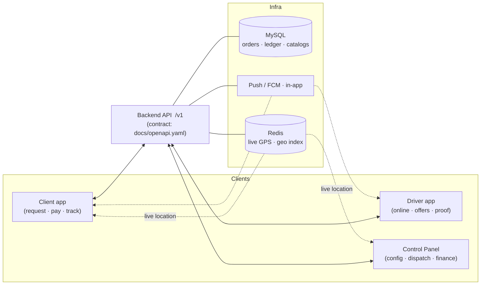
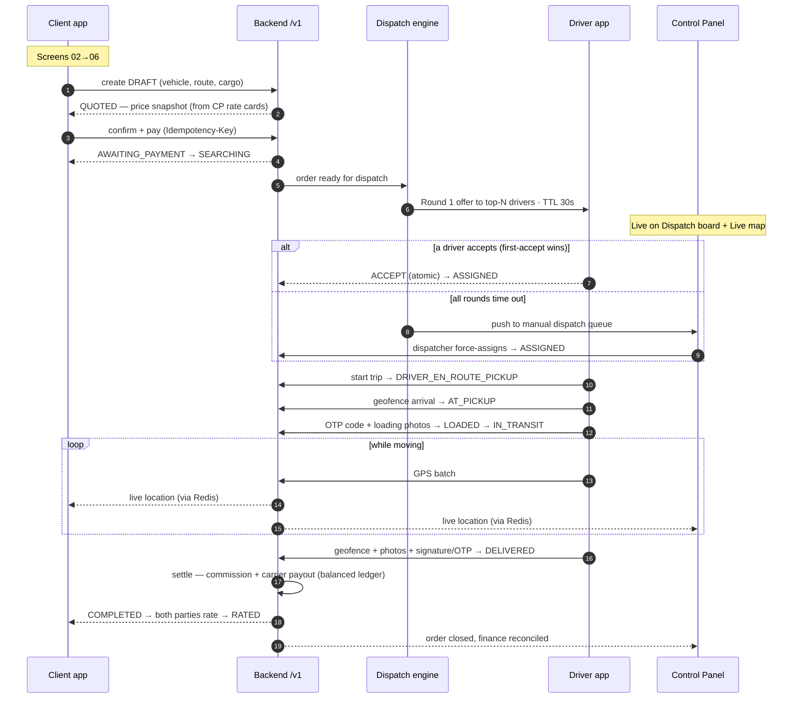
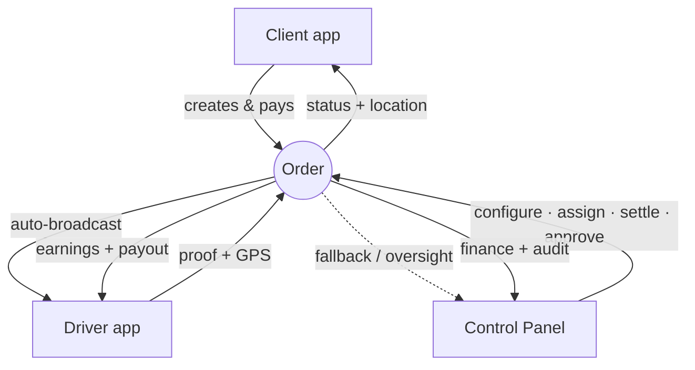

# NEXT Freight — App ↔ Control Panel Integration Flow

How the two mobile apps (**Client**, **Driver**) and the **Control Panel (CP)** work together
across the freight lifecycle. This document is the narrative companion to the mockups in this
folder — open [`index.html`](./index.html) to browse every screen referenced below.

> **The apps never talk to the CP directly.** All three surfaces are independent clients of the
> same **backend API** (`/v1`, contract in [`docs/openapi.yaml`](../docs/openapi.yaml)). The CP
> *configures* the platform and *supervises* live operations; the apps *consume* that configuration
> and *drive* orders through it. Everything they share flows through the backend and its database.

---

## 1. The three surfaces

| Surface | Who uses it | Role in the flow | Mockups |
|---|---|---|---|
| **Client app** (KMP) | Shippers | Request trucks, pay, track, rate | [`client/`](./client) |
| **Driver app** (KMP) | Drivers / carriers | Go online, accept offers, prove pickup & delivery, get paid | [`driver/`](./driver) |
| **Control Panel** (React) | Platform ops, fleets, brokers | Configure catalogs & pricing, dispatch, monitor live map, settle money, approve carriers | [`control-panel/`](./control-panel) |

They are **three separate builds** sharing one contract. Mobile & CP request/response types are
**generated** from `docs/openapi.yaml` — change the contract first, then implement.

---

## 2. Architecture — backend is the hub

**Two directions of integration:**

1. **CP → apps (configuration):** the CP writes catalog & rule rows (countries, currencies, languages,
   vehicle types, cargo types, rate cards, corridor fees, fees, thresholds, subscription plans,
   translations). The apps read these at runtime via `/v1/config` and `/v1/i18n`. **Nothing is
   hardcoded** — changing a vehicle capacity or a fee in the CP instantly changes what every app shows.
2. **apps → CP (operations):** the apps create and progress orders. The backend auto-dispatches;
   whatever it can't auto-assign surfaces on the CP **dispatch board** and **live map** for an operator.

---

## 3. What the CP controls that the apps consume

| CP screen | Configures | Where it shows up in the apps |
|---|---|---|
| [Pricing](./control-panel/04-pricing.png) | Rate cards, distance/weight factors, corridor fees, multipliers, VAT | Client [Quote](./client/04-quote.png) breakdown — computed server-side |
| Catalog (vehicles, cargo) | Vehicle types & capacities, cargo types, restricted-cargo rules | Client [Home](./client/02-home.png) vehicle picker & [Order wizard](./client/03-order-wizard.png) |
| Countries / currencies / i18n | Active countries, settlement currency, languages, `direction`, translations | Every screen — money format, RTL/LTR, all text via `messageKey` |
| Carrier approvals | Driver/fleet application review → `ACTIVE` / `CHANGES_REQUESTED` / `REJECTED` | Driver login gate → limited vs full token (can't go [online](./driver/01-online.png) until approved) |
| [Dispatch board](./control-panel/02-dispatch.png) | Offer rounds (radius, TTL, drivers/round), manual force-assign | Driver [job offers](./driver/02-offer.png) timer & radius |
| Finance | Commission %, payout methods & minimums, COD limits | Driver [earnings](./driver/04-earnings.png) & payout, Client [payment](./client/06-payment.png) methods |

> Golden rule: **the client never sends a price.** It's always computed from CP-managed rate cards and
> stored as an immutable `price_quotes` snapshot. The app only displays it.

---

## 4. End-to-end order flow

The single most important journey — how a shipment travels across all three surfaces.

### Order status map (backend state machine — the single source of truth)

`DRAFT → QUOTED → AWAITING_PAYMENT → SEARCHING → ASSIGNED → DRIVER_EN_ROUTE_PICKUP →
AT_PICKUP → LOADED → IN_TRANSIT → AT_DROPOFF → DELIVERED → (COD_PENDING) → COMPLETED → RATED`

All three surfaces read the **same status enum**; none of them set status directly — every change goes
through the backend state machine, which rejects illegal transitions regardless of caller.

---

## 5. Step-by-step, screen by screen

| # | Actor | Action | Surface / screen | Status after |
|---|---|---|---|---|
| 1 | Client | Pick vehicle + route + cargo | [Home](./client/02-home.png) → [Order wizard](./client/03-order-wizard.png) | `DRAFT` |
| 2 | Backend | Compute price from CP rate cards | [Quote](./client/04-quote.png) | `QUOTED` |
| 3 | Client | Confirm & pay (wallet / card / COD) | [Payment](./client/06-payment.png) | `AWAITING_PAYMENT` → `SEARCHING` |
| 4 | Dispatch | Broadcast offers to ranked drivers | (CP [Dispatch board](./control-panel/02-dispatch.png)) | `SEARCHING` |
| 5 | Driver | Accept the offer (first-accept wins) | [Job offer](./driver/02-offer.png) | `ASSIGNED` |
| 5b | Operator | If no accept, force-assign | CP [Dispatch board](./control-panel/02-dispatch.png) | `ASSIGNED` |
| 6 | Driver | Arrive + OTP code + loading photos | [Proof of pickup](./driver/03-proof.png) | `LOADED` → `IN_TRANSIT` |
| 7 | All | Watch the truck move in real time | Client [Tracking](./client/05-tracking.png), CP [Live map](./control-panel/05-livemap.png) | `IN_TRANSIT` |
| 8 | Driver | Deliver + photos + signature/OTP | (delivery proof) | `DELIVERED` → `COMPLETED` |
| 9 | Backend | Settle: commission + carrier payout | CP finance, Driver [Earnings](./driver/04-earnings.png) | `COMPLETED` → `RATED` |

---

## 6. Real-time & notification channels

| Channel | Direction | Used by |
|---|---|---|
| **Live GPS** (Redis geo) | Driver app → backend → Client + CP | [Tracking](./client/05-tracking.png), [Live map](./control-panel/05-livemap.png) |
| **Dispatch offers** (push + in-app) | Backend → Driver app | [Job offer](./driver/02-offer.png) with countdown TTL |
| **Status & event push** (FCM) | Backend → Client + Driver | Order updates, payment, payout, approvals |
| **Public tracking link** (`/v1/track`) | Backend → anyone with the token | Unauthenticated shipment tracking |

Historical GPS trail is persisted to `driver_locations`; **only live position lives in Redis**.

---

## 7. Integration contract rules (apply to every client)

These are the invariants every app and the CP must honour when talking to the backend:

- **Contract first.** `docs/openapi.yaml` is the source of truth; mobile & CP types are generated from it.
- **Envelopes.** Success: `{ success, data, meta }`. Error: `{ success:false, error:{ code, messageKey, params } }`.
- **No user-facing text in responses.** The backend returns `messageKey` + `params`; the client renders
  the translation from the shared i18n bundle (same endpoint for mobile & CP).
- **Money.** `long` minor units + `currencyCode` string — never floats. Settlement currency = pickup
  country currency; display currency is a per-user preference converted via a snapshotted FX rate.
- **Idempotency.** Every money-moving call (pay, payout, COD settle) sends an `Idempotency-Key` and
  writes balanced double-entry `ledger_entries`.
- **Standard headers** on every request: `Authorization`, `Accept-Language`, `X-Country-Code`,
  `X-Device-Id`, `X-App-Version`.
- **Authorization is server-side.** The CP hides buttons by permission code as a UX aid only; the backend
  is the real guard. Clients see only their own data (tenant + ownership scoping).
- **Timestamps are UTC** everywhere; convert to local only for display.

---

## 8. Where each actor sits in the live flow

- **Client app** starts and pays for the order, then tracks and rates.
- **Driver app** receives offers, executes the trip with proof, and gets paid.
- **Control Panel** sets the rules the order is priced and dispatched by, steps in when auto-dispatch
  can't place it, watches the live map, and settles the money — but it only ever acts *through the
  backend*, exactly like the apps.

---

*Rendered mockups: [`index.html`](./index.html) · Full product spec: [`../docs/README.md`](../docs/README.md) · API contract: [`../docs/openapi.yaml`](../docs/openapi.yaml)*
