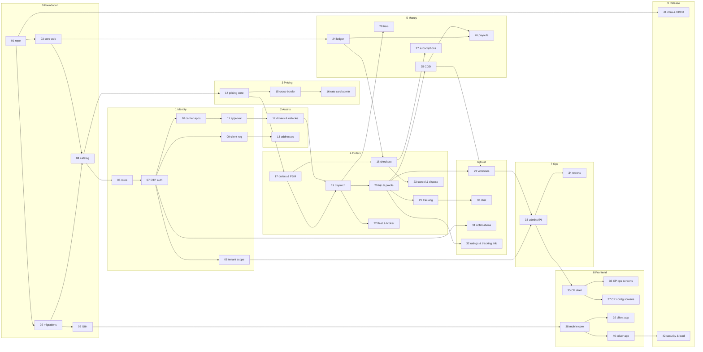

# NEXT Freight — Task Index

42 tasks. **One task per agent session.** Point Claude Code at a single task file plus the spec sections that task references — never at the whole `README.md`.

## How to run a session

```
Read CLAUDE.md and docs/tasks/17-order-creation-and-state-machine.md.
Read only the spec sections that task references.
State your plan, then implement it.
```

At the end of a session the agent should report: what changed, what it assumed, what is still open. Then start a fresh session for the next task.

## Dependency graph



## Full list

| # | Task | Phase | Depends on |
|---|---|---|---|
| 01 | Repo and build skeleton | 0 Foundation | — |
| 02 | Database migrations and seeds | 0 Foundation | 01 |
| 03 | Core web layer and error envelope | 0 Foundation | 01 |
| 04 | Catalog and bootstrap API | 0 Foundation | 02, 03 |
| 05 | Localization service | 0 Foundation | 02, 03 |
| 06 | Identity, roles and permissions | 1 Identity | 03, 04 |
| 07 | OTP authentication and tokens | 1 Identity | 06 |
| 08 | Tenant scoping and authorization | 1 Identity | 07 |
| 09 | Client registration | 1 Identity | 07 |
| 10 | Carrier applications | 1 Identity | 07 |
| 11 | Application review and approval | 1 Identity | 10 |
| 12 | Drivers, vehicles and documents | 2 Assets | 11 |
| 13 | Saved addresses | 2 Assets | 09 |
| 14 | Pricing engine core | 3 Pricing | 04 |
| 15 | Corridors and cross-border pricing | 3 Pricing | 14 |
| 16 | Rate card administration and simulation | 3 Pricing | 14, 15 |
| 17 | Order creation and state machine | 4 Orders | 14, 15 |
| 18 | Checkout and payment integration | 4 Orders | 17, 24 |
| 19 | Dispatch engine | 4 Orders | 17, 12 |
| 20 | Trip execution and proofs | 4 Orders | 17, 19 |
| 21 | Tracking and real-time | 4 Orders | 20 |
| 22 | Fleet and broker portal API | 4 Orders | 19, 12 |
| 23 | Cancellation, refunds and disputes | 4 Orders | 18, 24 |
| 24 | Wallet and double-entry ledger | 5 Money | 03, 04 |
| 25 | Cash on delivery | 5 Money | 20, 24 |
| 26 | Payouts and per-country rails | 5 Money | 24, 25 |
| 27 | Client subscriptions | 5 Money | 18, 24 |
| 28 | Carrier tiers and scoring | 5 Money | 19, 24 |
| 29 | Violation and compliance engine | 6 Trust | 19, 20, 25 |
| 30 | In-app chat | 6 Trust | 21 |
| 31 | Notifications and push | 6 Trust | 05, 07 |
| 32 | Ratings and public tracking | 6 Trust | 20 |
| 33 | Admin API, staff and system settings | 7 Ops | 08, 29 |
| 34 | Reporting and exports | 7 Ops | 33 |
| 35 | Control panel shell and RBAC | 8 Frontend | 33 |
| 36 | Control panel operations screens | 8 Frontend | 35 |
| 37 | Control panel configuration screens | 8 Frontend | 35 |
| 38 | Mobile core modules | 8 Frontend | 04, 05, 07 |
| 39 | Client mobile app | 8 Frontend | 38, 17, 18, 21 |
| 40 | Driver mobile app | 8 Frontend | 38, 19, 20, 26 |
| 41 | Infrastructure and CI/CD | 9 Release | 01 |
| 42 | Security hardening and load test | 9 Release | all |

## Critical path

`01 → 02/03 → 04 → 06 → 07 → 14 → 17 → 19 → 20 → 29 → 33 → 35 → 40`

Everything else can run in parallel once its dependencies land. Task 41 can start immediately alongside 01.

## Parallel tracks after task 08

Three tracks can proceed at once against the OpenAPI contract:

- **Backend track** — 09 through 34 in dependency order
- **Control panel track** — 35 as soon as 33 exists, then 36 and 37 in parallel
- **Mobile track** — 38 as soon as 04, 05 and 07 exist, then 39 and 40 in parallel

## Rules that apply to every task

1. If the task changes the API, update `docs/openapi.yaml` **first**, then implement.
2. If the task changes the schema, write the new `V13__`, `V14__` migration **first**. Never edit a merged migration.
3. Never finish a task with failing tests or a skipped acceptance criterion.
4. Stop and ask when a business rule is ambiguous, money is involved, or a security decision is needed.
5. Every new user-facing string is a translation key added to the seed translations in the same commit.
